# Focus 1 — Réaliser un État de l'art

_Source : `efrei/_raw/focus-1.pdf`_

_24 pages._

---

## Page 1

Réaliser un Etat de l’art/ Veille scientifique et technique
                         PPE-ING 2

                    2025-2026

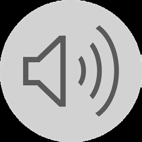

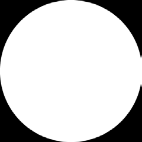

---

## Page 2

Réaliser un Etat de l’art/ Veille scientifique et technique
                         PPE-ING 2

                       2025-2026

---

## Page 3

               Sommaire

1. Rappels des attendus
2. Réaliser un Etat de l’art/ Veille scientifique et
 technique

---

## Page 4

Monday on a Monday

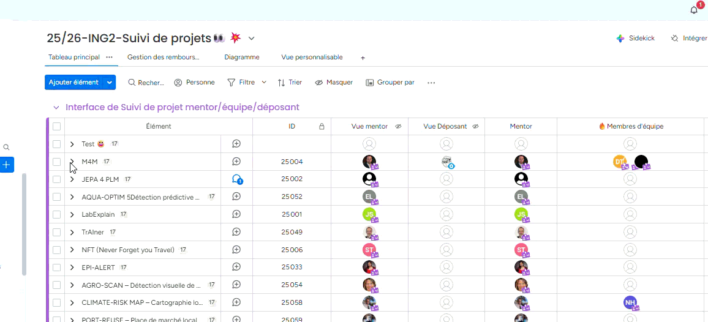

---

## Page 5

To check & to have

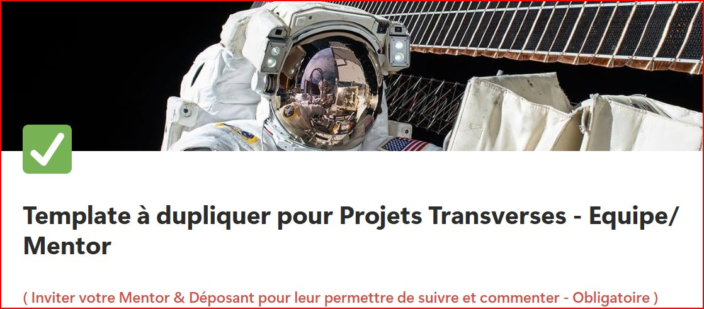

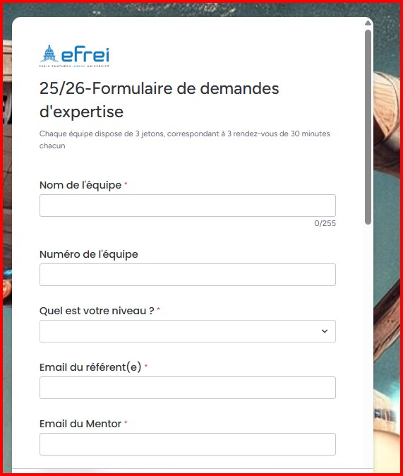

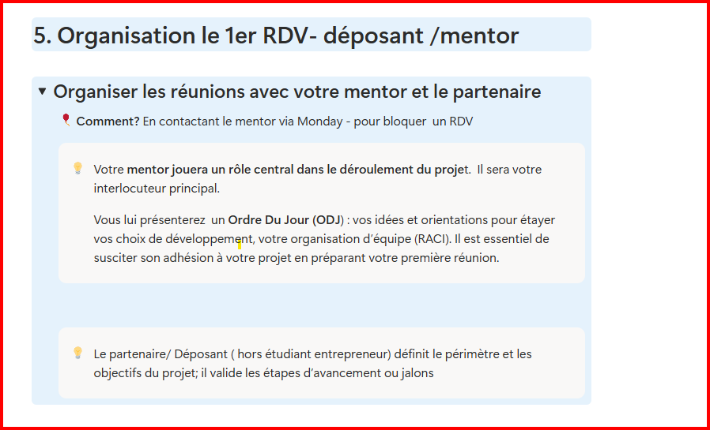

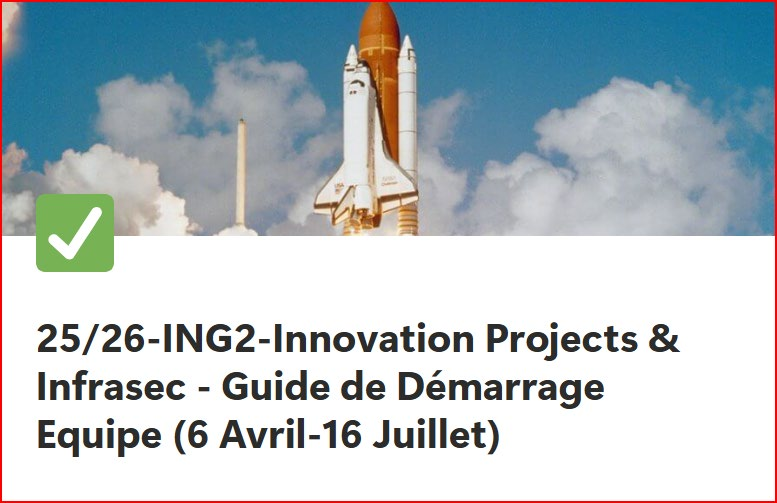

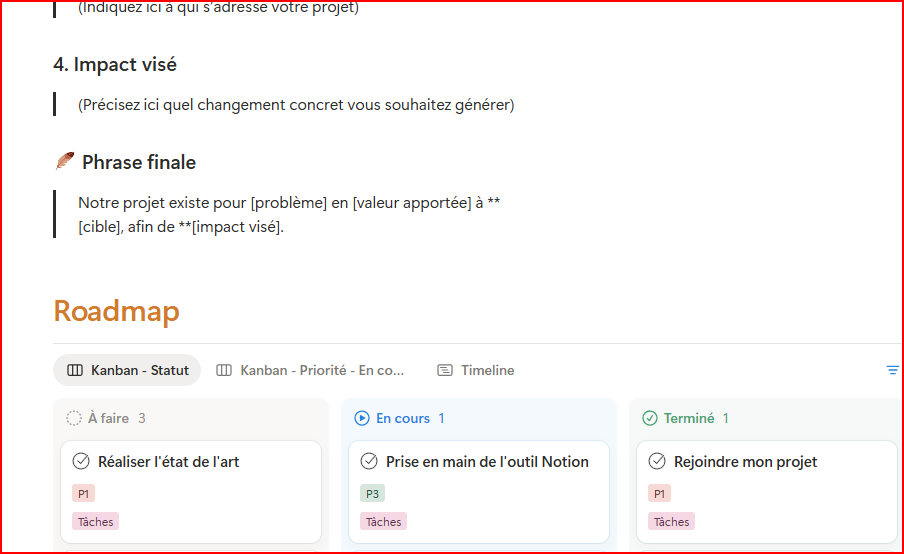

---

## Page 6

          Innovation Projects

Rapport      Poster             Démo

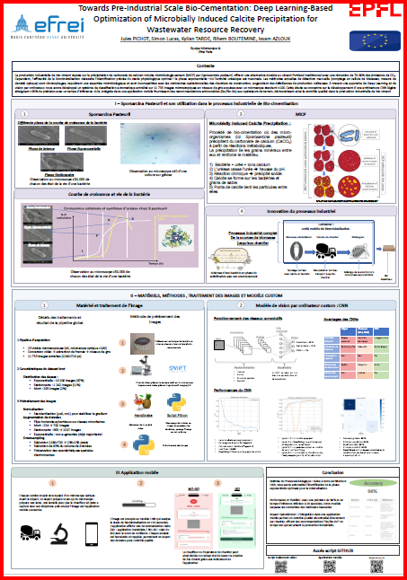

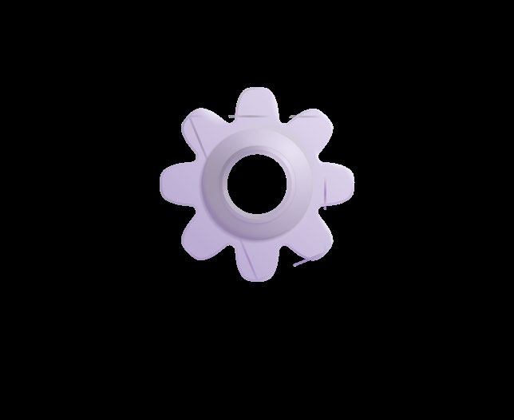

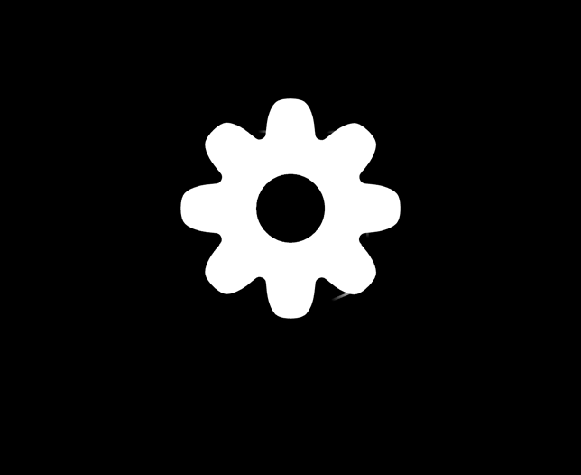

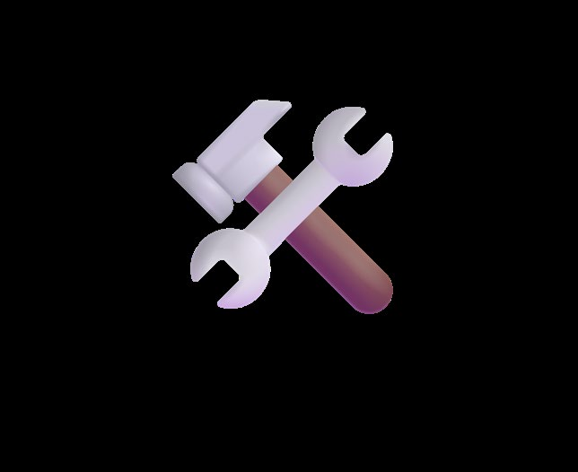

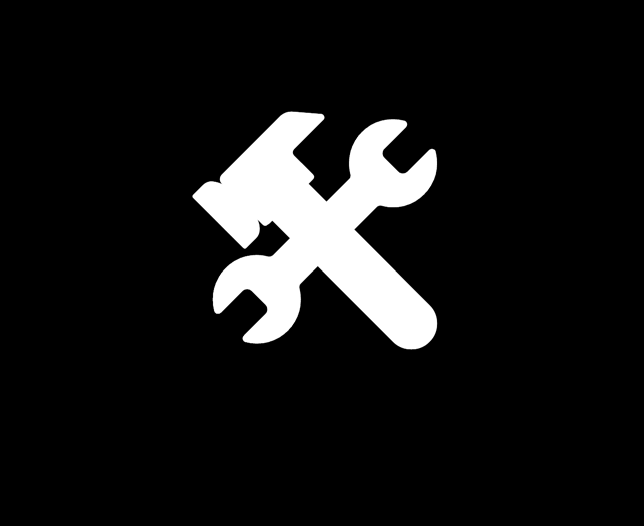

---

## Page 7

              Différents rapports
       pour des différents types projet
Des modèles de rapport de projet (plus) adaptés aux différentes typologies de projets
        (Partenaire, startup, étudiant, etc.) et aux 3 catégories de projets
                Projet de Service    , Projets Produit     Technique

                                               Construction du rapport en fonction
                                                  de la typologie des projets
                                                  Start Up     CDC- Lot 1   CDC- Lot 2   CDC- Lot 3

                                                  Part - Ent   CDC- Lot 1   CDC- Lot 2   CDC- Lot 3

                                                  Etudiant     CDC- Lot 1   CDC- Lot 2   CDC- Lot 3

                                                               CDC- Lot 1   CDC- Lot 2   CDC- Lot 3
                                                 Recherche

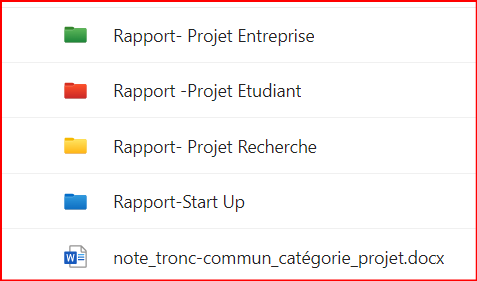

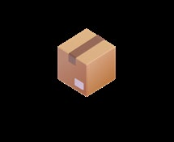

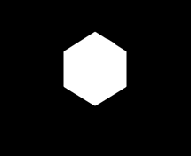

---

## Page 8

Rapport
            CDC
partie n1

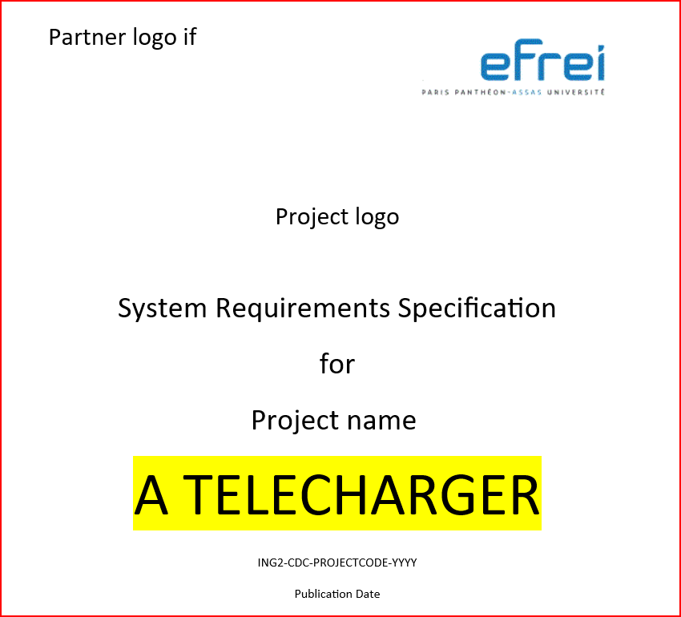

---

## Page 9

Partie Commune
  Etat de l’’art

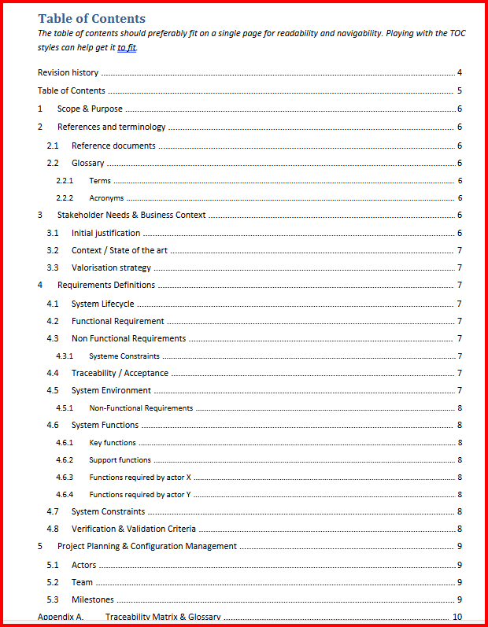

---

## Page 10

               Sommaire

1. Rappels des attendus
2. Réaliser un Etat de l’art/ Veille scientifique et
 technique

---

## Page 11

                                                                Innovation Project -
                                   Activités:    Focus thématique de 9 h15 à 10 h
                                                                                    Hotline                                                   Format
Dates Jour Mois   Séquencement                                                    Rescure sur Activités de l’équipe
                                   en distanciel
                                                                                  Teams                                           8 focus en distanciel de 50 min
6 au              Pré                                                                          Candidatez en équipe via le lien
10
     4    Avril
                  enregistrement
                                   Candidature des équipes
                                                                                               Calendly                              entre 9H10 approx 10H00
                  Cahier des                                                                   Disponible pour RDV Déposant &
10   V    Avril                    Kick-Off -
                  charges                                                                      Mentor
                  Cahier des       Focus 1 : Réaliser un Etat de l’art/ Veille                 Disponible pour RDV Déposant &
20   L    Avril
                  charges          scientifique et technique                                   Mentor
                  Cahier des       Focus 2 : Pourquoi un ingénieur doit penser                 Disponible pour RDV Déposant &
27   L    Avril
                  charges          “marché” ?                                                  Mentor
                  Cahier des                                                                   Disponible pour RDV Déposant &
4    L    Mai                      Focus 3: Pourquoi parler de vision produit ?
                  charges                                                                      Mentor

                  Phase de         Focus 4 : Pourquoi l’innovation sans veille est             Disponible pour RDV Déposant &
15   V    Mai
                  réalisation      une reproduction inconsciente ?                             Mentor

                  Phase de                                                                     Disponible pour RDV Déposant &
18   L    Mai                      Focus 5 : Eco - conception/ Green It
                  réalisation                                                                  Mentor
                  Phase de         Focus 6 : Création d’un Poster dans les                     Disponible pour RDV Déposant &
3    M    Juin
                  réalisation      règles de l’art                                             Mentor
                  Phase de                                                                     Disponible pour RDV Déposant &
12   V    Juin                     Focus 7 : Preuve de concept / TRL
                  réalisation                                                                  Mento
                  Phase de                                                                     Disponible pour RDV Déposant &
17   M    Juin                     Focus 8 : Bien préparer sa Démo
                  réalisation                                                                  Mento
                  Phase de         Focus 9 : Quand est-ce que le projet sera                   Disponible pour RDV Déposant &
22   L    Juin
                  réalisation      terminé ?                                                   Mento
                  Phase de                                                                     Disponible pour RDV Déposant &
2    J    Juillet                  Soutenance -Blanche- Factory
                  réalisation                                                                  Mento
                  Soutenance-
3    V    Juillet Poster-Prize     Soutenances- Bat New Republic
                  Demo
16   J    Juillet Poster-Prize     Poster-Prize Campus

---

## Page 12

    Intervention de
       Michael Ta
       Doctorant

Réaliser un Etat de l’art / Veille scientifique et technique
                                                               Michael.ta@efrei.fr
Par où commencer

---

## Page 13

L’art de faire l’état de l’art

             Michael TA
          michael.ta@efrei.fr

---

## Page 14

Avant-projet
               Brevet
               /CIRE

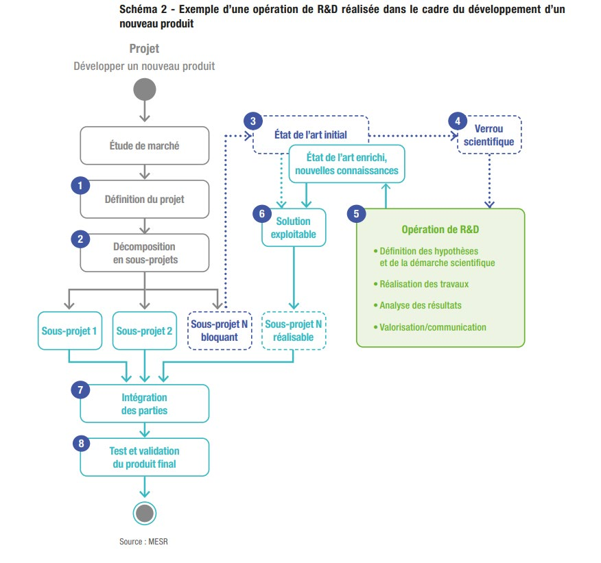

---

## Page 15

  L'état de l'art est un bilan des recherches et connaissances
 existantes sur un sujet donné, permettant de comprendre ce qui a
    déjà été fait, d'identifier les limites ou les lacunes dans le
domaine, et de poser les bases pour une contribution nouvelle et
                                pertinente

---

## Page 16

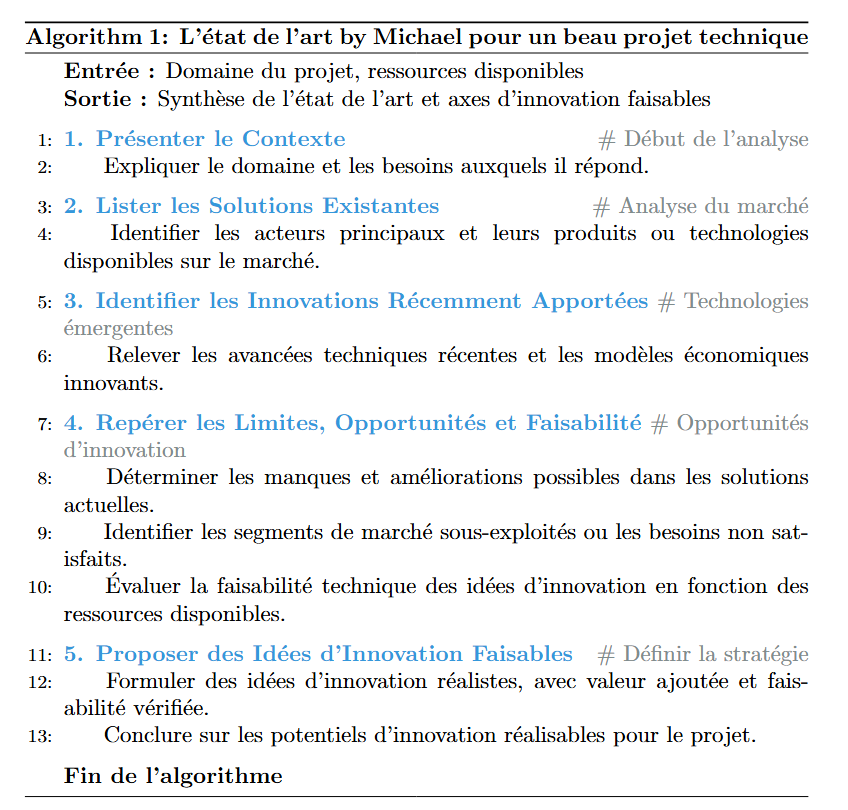

---

## Page 17

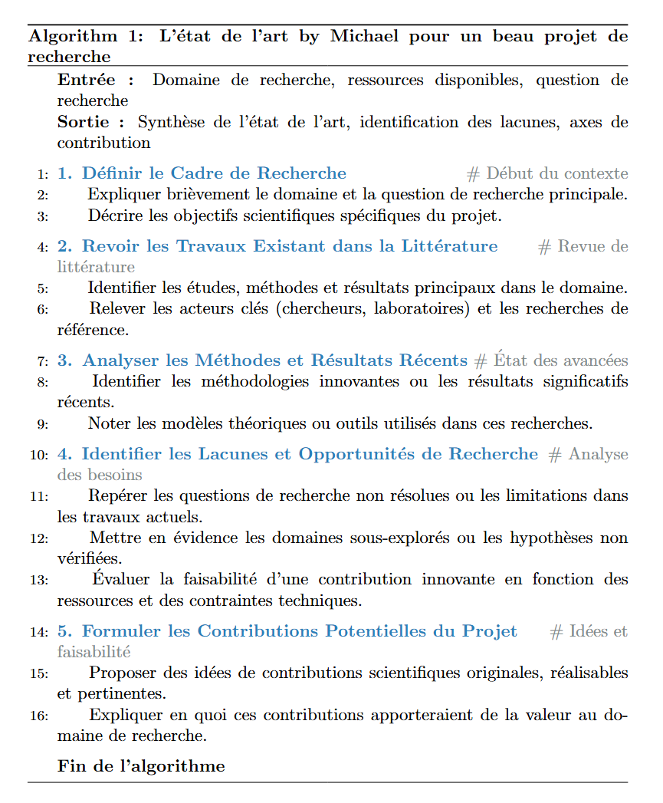

---

## Page 18

• Bases académiques
  Google Scholar: Moteur généraliste pour articles scientifiques, thèses et citations
  Scopus: Base bibliographique large avec métriques (citations, h-index)
  Web of Science: Référence pour analyses bibliométriques rigoureuses
  IEEE: Recherche de référence en ingénieurie
  HAL: Archive ouverte francophone multidisciplinaire.
  Semantic Scholar: Recherche enrichie

---

## Page 19

   Idéation
                  • Trouver une thématique innovante

   Recherche
bibliographique
                  • Comprendre l’existant

  Benchmark
                  • Comparer les solutions

  Conception
                  • Créer un prototype

  Validation
                  • Tester, comparer, valider, critiquer

---

## Page 20

• Contexte
   Localiser les nageurs
• Mots clés
   Signal, propagation du signal, algorithmes de localisation, environnement intérieur
• Limites scientifiques
   Propagation dans l’eau, algorithmes de localisation en intérieur
• Objectifs de l’état de l’art
   Quel signal choisir pour notre cas d’application ? (Propagation dans un environnement complexe)
   Quels algorithmes choisir pour traiter les data ?

---

## Page 21

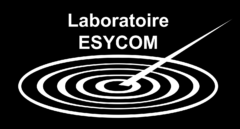

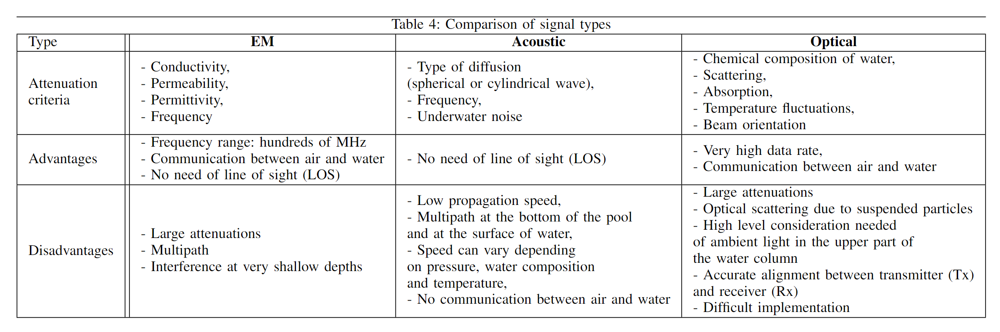

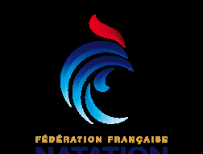

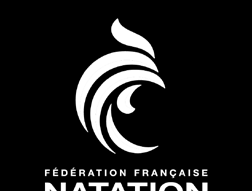

---

## Page 22

      Article             Application         Environmental       Signal type   Operational          Ranging
                                               conditions                       Frequency
  Cappelli I, Fort A,   Communication using   Swimming pool and       EM        868 MHz (LoRa)         110 cm
  Mugnaini M et al.          LoRa                 fountains

  Ryecroft SShaw           Water quality           Rivers             EM           433 MHz             50 cm
  AFergus P et al.          monitoring

    Gianni Cario,          Water quality            Sea             Acoustic      25-40 kHz          110-260 m
Alessandro Casavola,        monitoring
 Petrika Gjanc et al.

Cassel M, Dépret T,       Pebble mobility          Rivers             EM           433 MHz             50 cm
    Piégay H                monitoring

Rubino E, Centelles        Communication       Swimming pool          EM           433 MHz       40 cm of depth, 6 m
 Dn Sales J et al.      between Autonomous
                         Underwater Vehicle

  Benjamin Meyer,          Communication            Sea             Acoustic      18-34 kHz             10 m
 Cedric Isokeit, Erik   between Autonomous
      Maehle             Underwater Vehicle

Conclusion: dans l’eau douce, utilisation signal EM possible à une fréquence 433 MHz ou 868 MHz

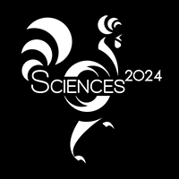

---

## Page 23

   Michael TA
michael.ta@efrei.fr

---

## Page 24

                                           Tech Day
                                                Mercredi 12 Juin 2024

    Une question ? Contactez nous – RDV –
sur la HOTLINE RESCUE -    TEAMS

Olivier Girinsky – RESP. PÔLE EXPERTISES PROJETS TRANSVERSES olivier.girinsky@efrei.fr

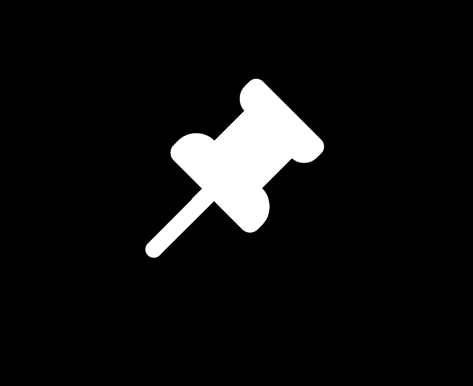

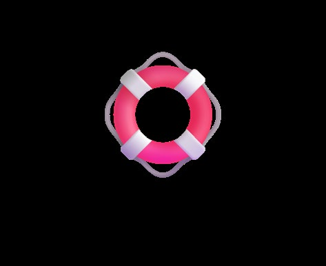

