# Focus 2 — Pourquoi un ingénieur doit penser « marché » ?

_Source : `efrei/_raw/focus-2.pdf`_

_44 pages._

---

## Page 1

              Projets Transverses- PGE

INNOVATION PROJECTS – 25/26
        FOCUS N°2
     Pourquoi un ingénieur doit penser “marché” ?
                      PPE-ING 2

                    2025-2026

---

## Page 2

              Projets Transverses- PGE

INNOVATION PROJECTS – 25/26
        FOCUS N°2
     Pourquoi un ingénieur doit penser “marché” ?
                      PPE-ING 2

                    2025-2026

---

## Page 3

             Sommaire

1. Rappels des attendus

2. Pourquoi un ingénieur doit penser “marché”

---

## Page 4

Monday on a Monday

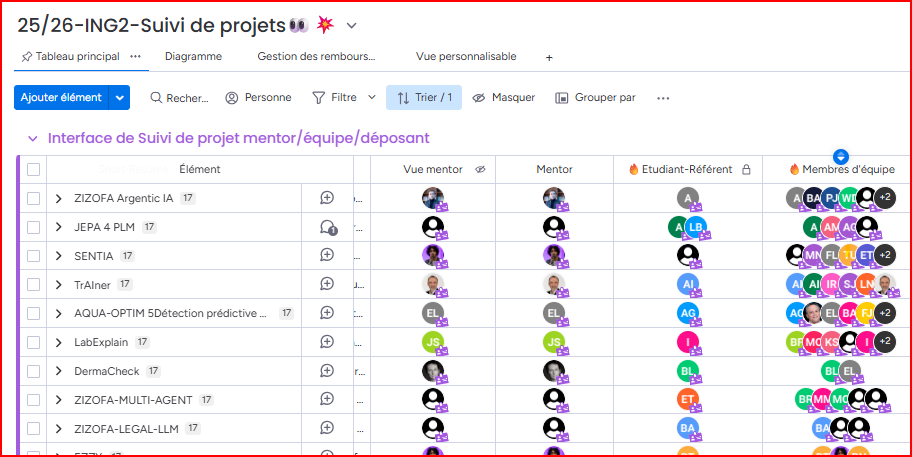

---

## Page 5

Monday on a Monday

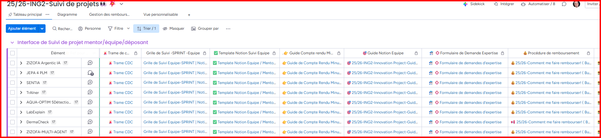

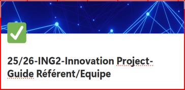

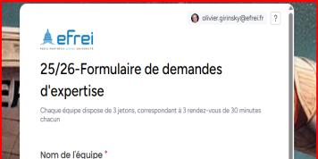

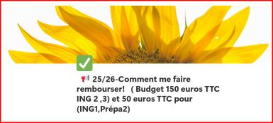

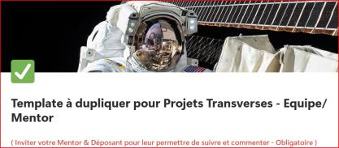

---

## Page 6

Liste des Experts

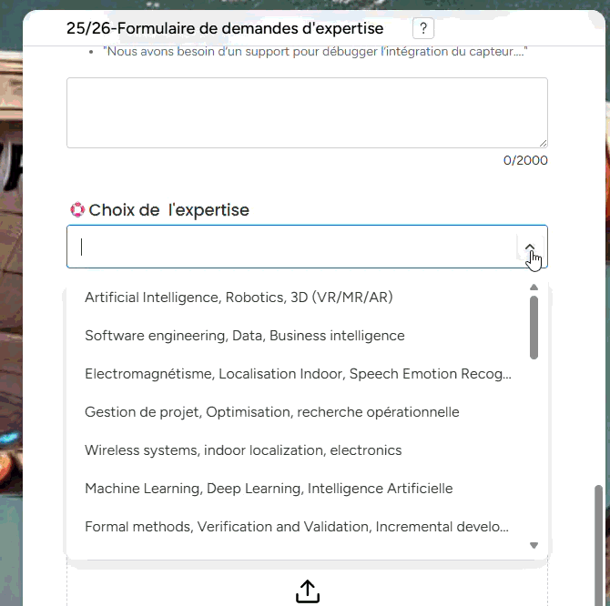

---

## Page 7

                 Innovation Projects Rendus

   Rapport
LateX-Overleaf            Poster         Démo
                      LateX-Overleaf

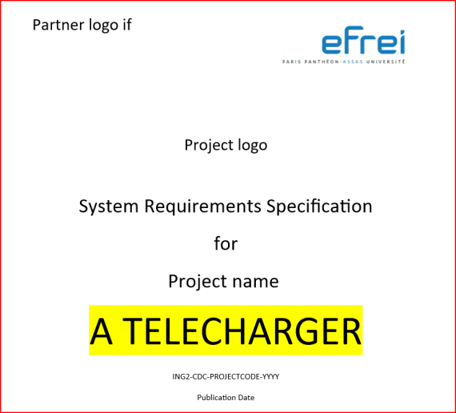

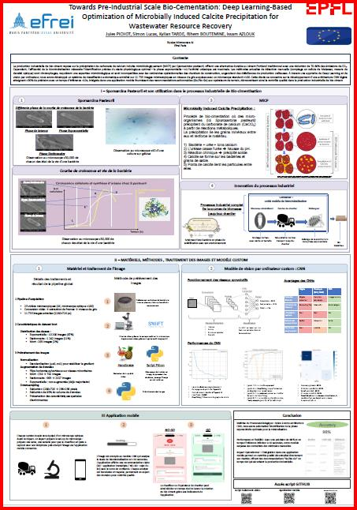

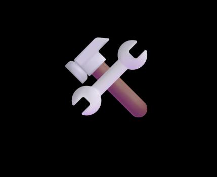

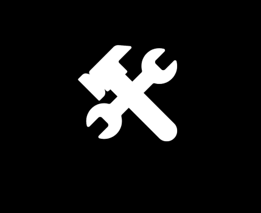

---

## Page 8

Techniques de prompting avancé                                                                                                                        PROMPTING AVANCÉ

Quatre techniques pour obtenir des réponses plus structurées, cohérentes et exploitables.

   01 Chain of Thought                                                                             02 Few-shot Prompting

         Demandez à l’IA de réfléchir étape par étape.                                                   Fournissez des exemples dans le prompt.
           Améliore drastiquement le raisonnement complexe.                                                 L’IA imite le style et la structure.

         Exemple :                                                                                       Exemple :
         « Explique ton raisonnement étape par étape avant de donner la réponse finale. »                « Voici 3 exemples de ce que je veux… Maintenant fais de même pour… »

   03 Self-Consistency                                                                             04 ReAct — Reasoning + Acting

         Générez plusieurs réponses et gardez la plus cohérente.                                         L’IA raisonne, agit avec des outils, observe, puis itère.
            Réduit les hallucinations.                                                                       Approche dynamique et fiable.

         Exemple :                                                                                       Exemple :
         « Génère 3 réponses différentes, puis indique laquelle est la plus cohérente. »                 « Réfléchis, utilise les outils disponibles, observe les résultats, puis affine si nécessaire.
                                                                                                         »

*Slide de présentation : Orchestrer pour mieux performer le paradigme des agents de l’IA- 24/04

                                                     À retenir : un prompt avancé n’est pas plus long ; il rend la réponse contrôlable.

---

## Page 9

            Sommaire

1. Rappels des attendus

2. Pourquoi un ingénieur doit penser
 “marché”

---

## Page 10

                                                                Innovation Project -
                                                                 Tips and Tricks
                                   Activités:    Focus thématique de 9 h15 à 10 h
                                                                                    Hotline                                                   Format
Dates Jour Mois   Séquencement                                                    Rescure sur Activités de l’équipe
                                   en distanciel
                                                                                  Teams                                           8 focus en distanciel de 50 min
6 au              Pré                                                                          Candidatez en équipe via le lien
10
     4    Avril
                  enregistrement
                                   Candidature des équipes
                                                                                               Calendly                              entre 9H10 approx 10H00
                  Cahier des                                                                   Disponible pour RDV Déposant &
10   V    Avril                    Kick-Off -
                  charges                                                                      Mentor
                  Cahier des       Focus 1 : Réaliser un Etat de l’art/ Veille                 Disponible pour RDV Déposant &
20   L    Avril
                  charges          scientifique et technique                                   Mentor
                  Cahier des       Focus 2 : Pourquoi un ingénieur doit penser                 Disponible pour RDV Déposant &
27   L    Avril
                  charges          “marché” ?                                                  Mentor
                  Cahier des                                                                   Disponible pour RDV Déposant &
4    L    Mai                      Focus 3: Pourquoi parler de vision produit ?
                  charges                                                                      Mentor

                  Phase de         Focus 4 : Pourquoi l’innovation sans veille est             Disponible pour RDV Déposant &
15   V    Mai
                  réalisation      une reproduction inconsciente ?                             Mentor

18   L    Mai
                  Phase de
                  réalisation
                                   Focus 5 : Eco - conception/ Green It
                                                                                               Disponible pour RDV Déposant &
                                                                                               Mentor
                                                                                                                                    POP UP GUEST
3    M    Juin
                  Phase de
                  réalisation
                                   Focus 6 : Création d’un Poster dans les
                                   règles de l’art
                                                                                               Disponible pour RDV Déposant &
                                                                                               Mentor
                                                                                                                                     20 min Retex –
12   V    Juin
                  Phase de
                  réalisation
                  Phase de
                                   Focus 7 : Preuve de concept / TRL
                                                                                               Disponible pour RDV Déposant &
                                                                                               Mento
                                                                                               Disponible pour RDV Déposant &
                                                                                                                                      20 min Q&R
17   M    Juin                     Focus 8 : Bien préparer sa Démo
                  réalisation                                                                  Mento
                  Phase de         Focus 9 : Quand est-ce que le projet sera                   Disponible pour RDV Déposant &
22   L    Juin
                  réalisation      terminé ?                                                   Mento
                  Phase de                                                                     Disponible pour RDV Déposant &
2    J    Juillet                  Soutenance -Blanche- Factory
                  réalisation                                                                  Mento
                  Soutenance-
3    V    Juillet Poster-Prize     Soutenances- Bat New Republic
                  Demo
16   J    Juillet Poster-Prize     Poster-Prize Campus

---

## Page 11

                                                          2027- Get a Job

Plus l’exécution baisse de coût, plus ces dimensions montent

Jugement Contextuel                    Relation & Confiance                      Problem Farming           Responsabilité
Décider dans l’ambiguïté,              Crédibilité ,gestions des                 Poser la bonne question   Vérifier, Expliquer, porter le
    abriter, assumer                   tendances et fédérer                      avant la bonne réponse    résultat final

   Extrait de Présentation de Deloitte – 23/04/26- Avantage de l’humain dans l’ère de l’IA

---

## Page 12

                                                        2027- Get a Job

La combinaison gagante est désormais hybride

                                           Expertise Métier                                 IA fluent & Agents

      Ingénieur
                                          Pensée critique IA                                Vison Systémique
     Augemnté

                                       Soft skills Transverses                             Curiosité adaptabilité

                           Expert domaine + pilote de l’IA+ communicant + apprenant continu

 Extrait de Présentation de Deloitte – 23/04/26- Avantage de l’humain dans l’ère de l’IA

---

## Page 13

                          Pourquoi un ingénieur doit penser “marché”

  Intervention de
Caroline FRUITET

    LA MATRICE STRATÉGIQUE                             Caroline FRUITET
  « Transformer l’idée en prototype »                caroline.fruitet@efrei.fr

---

## Page 14

  27 Avril 2026

La Matrice Stratégique
Pourquoi un ingénieur doit-il penser « marché » ?

  PPE – ING 2

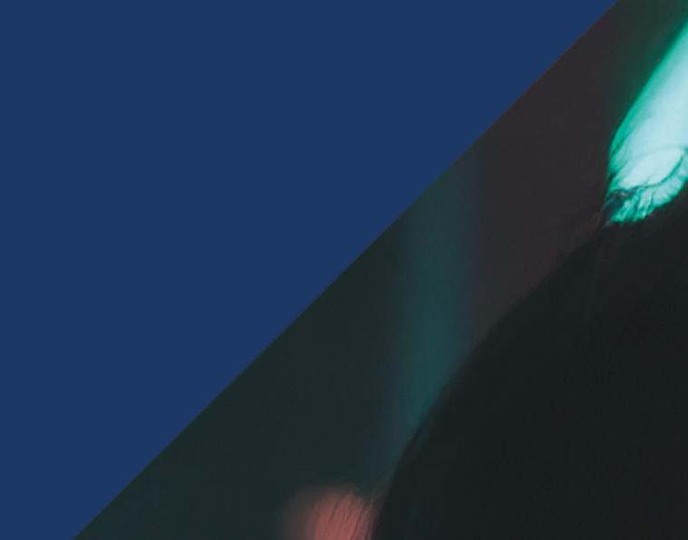

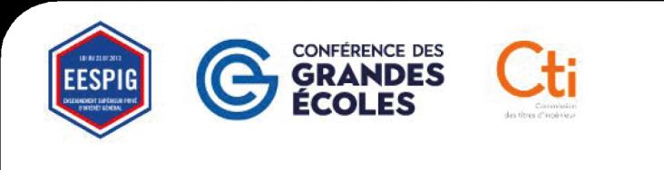

---

## Page 15

Qui je suis ?
            Caroline Fruitet
                Enseignante en Communication & Marketing Digital

                Parcours

            > Mon Expertise : 10+ années en Marketing Digital et en Communication
            > Une expertise forgée notamment à l'international (Australie et États-Unis)
            > Essentiellement chez l’annonceur mais aussi en agence marketing
            > Des entreprises, marques & secteurs variés : Pandora, YellowKorner, Optus Télécom
            > Des clients dans le monde de la beauté (L'Oréal, OPI)
            > Intervenante dans les écoles (2020) / Enseignante permanente à l'Efrei (2024)
                                                                                                  <<<
                Caroline.fruitet@efrei.fr

---

## Page 16

La Matrice Stratégique : Transformer l’idée en prototype
   > Ne construisez pas le 'bon' produit, construisez le produit dont on a besoin.
    ➢ L’intérêt de penser « marché », « cibles » et « positionnement »
    ➢ Être capable de prendre de la hauteur par rapport à votre projet
    ➢ Avoir une vision plus globale et plus stratégique

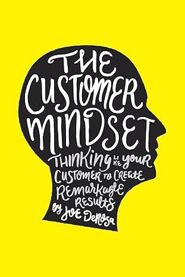

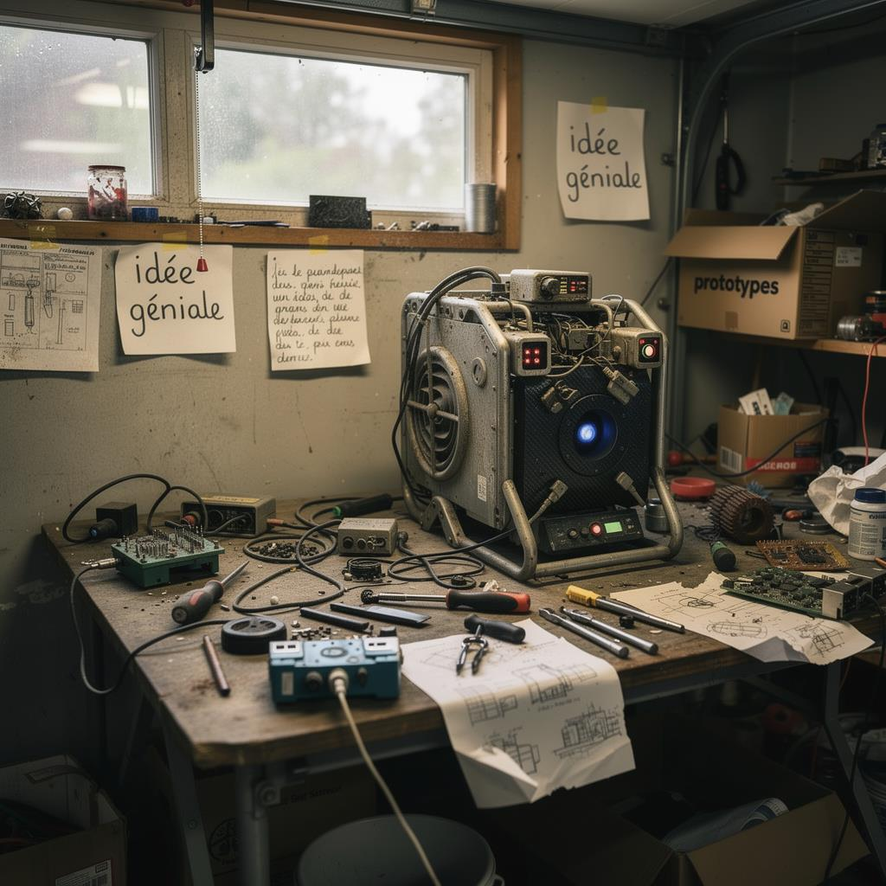

---

## Page 17

Le Syndrome de l’Ingénieur (Le Piège)
  > L’erreur classique : se concentrer sur sa solution technique, son produit
    Et ne pas suffisamment prendre en considération les
    aspects stratégiques, commerciaux et marketing de son
    produit.

    Voici quelques statistiques très parlantes :

    60% des startups françaises disparaissent avant 4 ans.
    Aux États-Unis, 50% ne survivent pas à leur 1ère année.
    (source : Figaro Économie).

    Causes possibles : Un produit techniquement parfait… mais
    sans marché / Une stratégie marketing défaillante / Un
    manque d’anticipation de l’évolution du marché, etc.
    ➢ Trouver le bon marché
    ➢ Connaitre parfaitement ses cibles et pouvoir les atteindre
    ➢ Savoir mettre en avant son offre
    ➢ Pour cela, des outils stratégiques sont disponibles

---

## Page 18

PHASE 1 :1 : LE
  PHASE
LEDIAGNOSTIC
DIAGNOSTIC

---

## Page 19

Le SWOT – Définition & Usages
  > Un outil très utilisé

    Définition :

    ➢ L'analyse SWOT est un outil d'analyse stratégique incontournable pour évaluer la santé
      d’une entreprise face à son marché.

    ➢ L’analyse prend en considération 4 angles clés.

    ➢ SWOT = Strengths (Forces), Weaknesses (Faiblesses), Opportunities (Opportunités),
      Threats (Menaces).

    ➢ Eléments Internes (ce que vous contrôlez : forces/faiblesses).
    ➢ Eléments Externes (ce que vous ne contrôlez pas : opportunités/menaces).

    ➢ En croisant vos atouts internes avec les réalités externes, vous obtenez une vision
       claire pour lancer un projet ou consolider un business plan.

---

## Page 20

Le SWOT – Définition & Usages
  > Un outil très utilisé

    Usages :

    ➢ Prioriser les risques majeurs avant de lancer un produit.

    ➢ Identifier des axes de différenciation face à la concurrence.

    ➢ Valider la viabilité d’un projet en équipe.

    Comment ça marche ?

    ➢ Étape 1 : Faire la liste des différents éléments dans chaque
      quadrant (brainstorming).

    ➢ Étape 2 : Croiser les données pour trouver des stratégies :
      Exemple : Une force (ex : brevet) + une opportunité (ex :
      marché en croissance) = stratégie offensive.

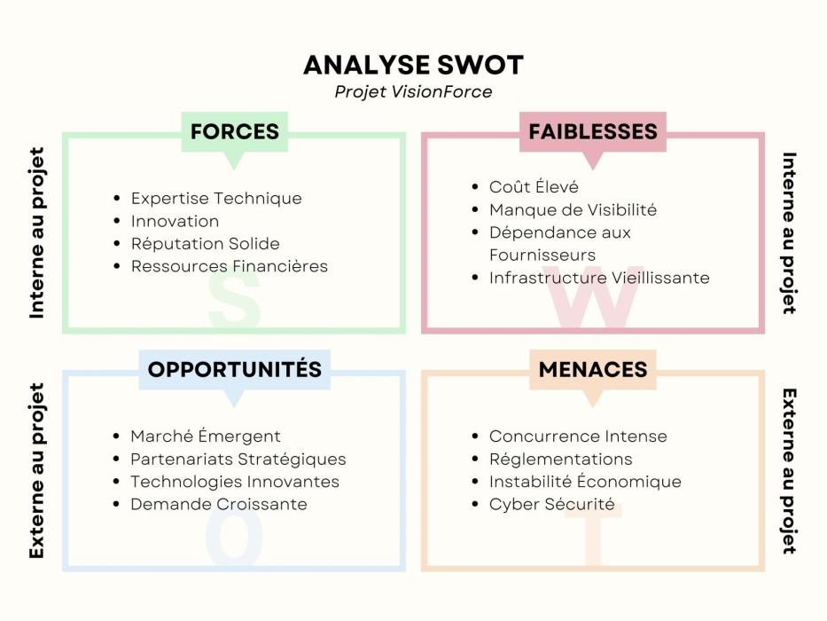

---

## Page 21

Le SWOT – Application
  > Sac à dos solaire

    ➢ Afin de mettre en application cette matrice, imaginez que vous souhaitez lancer une nouvelle
      marque de sac à dos solaires.

    ➢ Note : cet exemple ne prétend pas être 100% véridique mais sert à illustrer l’utilisation du SWOT.

   Forces (Interne)                                   Faiblesses (Interne)
   - Technologie brevetée de panneaux solaires
                                                      - Coût de production élevé (200€/unité).
   ultra-légers.
                                                      - Réseau de distribution limité (vente en ligne
   - Équipe experte en matériaux durables.
                                                      uniquement).
   - Design ergonomique et résistant à l’eau.         - Marque inconnue (pas de notoriété).
   Opportunités (Externe)                             Menaces (Externe)
   - Marché des accessoires outdoor en croissance     - Concurrents établis (ex : The North Face,
   (+15%/an).                                         Patagonia).
   - Subventions pour les produits éco-               - Réglementation sur les batteries lithium (risque
   responsables.                                      de restrictions).
   - Partenariats possibles avec des festivals ou     - Sensibilité des consommateurs au
   ONG.                                               greenwashing.

---

## Page 22

Le SWOT – Application & Solutions
  > Sac à dos solaire

   ➢ Comment SunPack pourrait exploiter ses forces pour saisir une opportunité ?

   ➢ Exemple : Utiliser son brevet pour cibler les festivals (opportunité) via des partenariats
     (stratégie offensive).

   Forces (Interne)                                    Faiblesses (Interne)
   - Technologie brevetée de panneaux solaires
                                                       - Coût de production élevé (200€/unité).
   ultra-légers.
                                                       - Réseau de distribution limité (vente en ligne
   - Équipe experte en matériaux durables.
                                                       uniquement).
   - Design ergonomique et résistant à l’eau.          - Marque inconnue (pas de notoriété).
   Opportunités (Externe)                              Menaces (Externe)
   - Marché des accessoires outdoor en                 - Concurrents établis (ex : The North Face,
   croissance (+15%/an).                               Patagonia).
   - Subventions pour les produits éco-                - Réglementation sur les batteries lithium (risque
   responsables.                                       de restrictions).
   - Partenariats possibles avec des festivals ou      - Sensibilité des consommateurs au
   ONG.                                                greenwashing.

---

## Page 23

Le SWOT – Suite & fin
  > Avantages & Limites du SWOT :

   ➢ Le SWOT n’est pas une solution parfaite mais combiné à d’autres outils, il permet une certaine
     prise de recul et aide à prendre des décisions stratégiques.

   Avantages                                         Limites
                                                     - Parfois subjectif (dépend des perceptions de
   - Simple et visuel.
                                                     l’équipe) → se baser sur des données précises.
   - Permet une vue d’ensemble.                      - Ne donne pas de solutions clés en main.
                                                     - Risque de surcharge (trop d’éléments listés) →
   - Adaptable à tout type de projet.
                                                     hiérarchiser

---

## Page 24

La Matrice BCG – Définition & Usages
  > BCG : Votre idée a-t-elle un futur ?

    Définition :

    ➢ Outil de portefeuille produit créé par le Boston Consulting Group, dont il tire son nom.

    ➢ Classe les produits en 4 catégories selon 2 axes :

    •   Part de marché (axe horizontal).
    •   Croissance du marché (axe vertical).

    Usages :

    ➢ Décider où investir (ou désinvestir) dans un portefeuille de produits.
    ➢ Identifier les produits "vedettes" à développer et les "poids morts" à abandonner.
    ➢ En croisant vos atouts internes avec les réalités externes, vous obtenez une vision claire
        pour lancer un projet ou consolider un business plan.

---

## Page 25

La Matrice BCG – Définition & Usages
  > BCG : Votre idée a-t-elle un futur ?

    Comment ça marche :

    ➢ 4 quadrants :

    ➢ Vedettes (Stars) : Croissance élevée + part de
       marché élevée → Investir.

    ➢ Dilemmes (Question Marks) : Croissance élevée
       + part de marché faible → Analyser.

    ➢ Vaches à lait (Cash Cows) : Croissance faible +
       part de marché élevée → Exploiter.

    ➢ Poids morts (Dogs) : Croissance faible + part de
       marché faible → Abandonner.

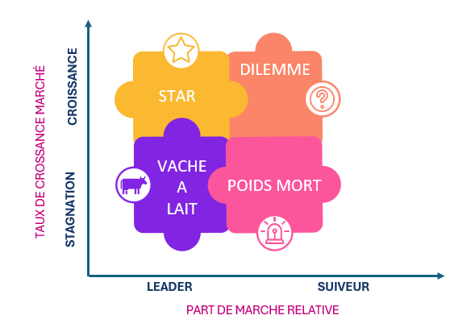

---

## Page 26

     La Matrice BCG – Illustration : Le cas d’Apple en France
      > BCG : Boston Consulting Group

Très bonne part de marché et

                                                             CROISSANCE
                                                                                                         Une place pas encore trouvée en

                                TAUX DE CROSSANCE MARCHÉ
bénéfices importants                                                                                     France
                                                                                      APPLE
                                                                                      WATCH

 Peu d’investissement & l’App                                                                            Produit abandonné au profit du
 Store génère des milliards                                                 APP

                                                           STAGNATION
                                                                                                         Smartphone
                                                                           STORE       IPOD

                                                                          LEADER               SUIVEUR
                                                                             PART DE MARCHE RELATIVE

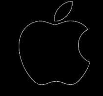

---

## Page 27

La Matrice BCG – Illustration fictive
   > Sac à dos solaire

    ➢ Afin de mettre à nouveau en application cette matrice, imaginez que vous souhaitez lancer une
      nouvelle marque de sac à dos solaires.

    ➢ Note : cet exemple ne prétend pas être 100% véridique mais sert d’illustration.

    Quadrant                          Position de SunPack                    Stratégie

                                      - Marché des accessoires solaires
                                        en croissance (+20%/an).             Investir : Développer des modèles
    Vedette
                                      - SunPack a 10% de part de             premium, étendre la distribution.
                                        marché (leader émergent).
                                      - Gamme "SunPack Lite" (modèle         Tester : Lancer une campagne de
    Dilemme                           low-cost) : part de marché de 2% sur   pré-commandes pour valider la
                                      un marché en croissance.               demande.
                                      - Gamme "SunPack Pro" (pour
                                                                             Exploiter : Optimiser les coûts,
    Vache à lait                      professionnels) : part de marché de
                                                                             fidéliser les clients B2B.
                                      30% sur un marché mature.
                                      - Gamme "SunPack Kids" (sac
                                                                             Abandonner : Arrêter la production,
    Poids mort                        pour enfants) : part de marché de 1%
                                                                             réallouer les ressources.
                                      sur un marché saturé.

---

## Page 28

La Matrice BCG– Suite & fin
  > Avantages & Limites :

    ➢ La matrice BCG permet, elle aussi, une certaine prise de hauteur et aide à
      prendre des décisions stratégiques, notamment au niveau de nos gammes
      de produits et offres.

    ➢ "Si votre produit est un 'Poids mort', pivotez ou abandonnez-le.

    ➢ Exemple : Juicero était un 'Dilemme' (marché en croissance mais part de
      marché faible)… qui aurait dû être abandonné plus tôt."

    Avantages                                      Limites
                                                   - Ne prend pas en compte les synergies
    - Simple et visuel.
                                                   entre produits.
    - Aide à hiérachiser les investissements.      - Binaire (ne reflète pas les nuances).
                                                   - Données de marché parfois difficiles à
    - Utile pour les entreprises multi-produits.
                                                   obtenir.

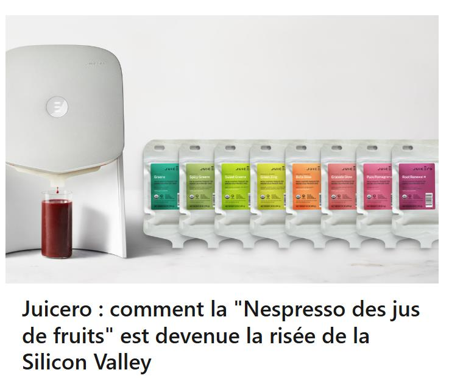

---

## Page 29

PHASE
 PHASE1 2: : LA
LE
 STRUCTURE
DIAGNOSTIC

---

## Page 30

Le Business Model Canvas – Définition & Usages
  > BMC : Les 3 piliers pour construire votre modèle économique

   Définition :

   Outil visuel pour décrire, concevoir et innover un modèle économique.

   ➢ 9 blocs organisés en 3 piliers suivants :

   ➢ Offre : Proposition de valeur, segments clients.
   ➢ Infrastructure : Activités clés, ressources, partenaires.
   ➢ Finances : Flux de revenus, structure de coûts.

   Usages :

   ➢ Clarifier comment votre entreprise crée, délivre et capture de la valeur.
   ➢ Identifier les hypothèses clés à valider (ex : "Les clients paieront-ils 200€ pour ce sac ?").
   ➢ Communiquer votre modèle à des investisseurs ou partenaires.

---

## Page 31

Le Business Model Canvas – Suite
  > BMC : Les 3 piliers pour construire votre modèle économique

   Comment ça marche ?

   ➢ Étape 1 : Remplir chaque bloc avec des post-its
     (brainstorming).

   ➢ Étape 2 : Identifier les dépendances entre blocs
   (ex : "Si mon segment client change, ma proposition de
   valeur doit s’adapter").

   ➢ Étape 3 : Tester les hypothèses les plus risquées
   (ex : "Les randonneurs sont-ils prêts à payer pour un sac
   solaire ?").

   Rappel des piliers :
   ➢ Offre : Proposition de valeur, segments clients.
   ➢ Infrastructure : Activités clés, ressources, partenaires.
   ➢ Finances : Flux de revenus, structure de coûts.

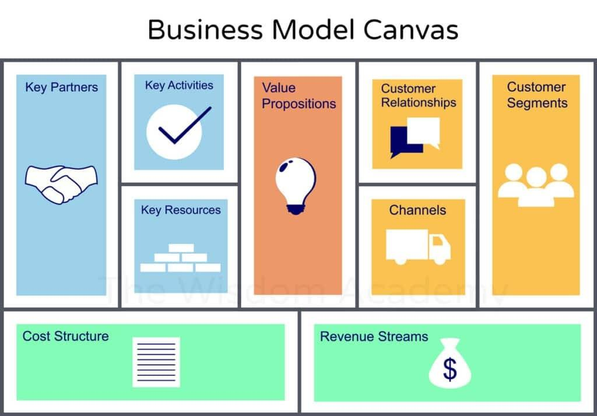

---

## Page 32

Le Business Model Canvas – Application
  > Sac à dos solaire
   ➢ Afin de mettre en application cette matrice, imaginez que vous souhaitez lancer une nouvelle
     marque de sac à dos solaires.

   ➢ Note : cet exemple ne prétend pas être 100% véridique mais sert d’illustration.

   Bloc               Contenu pour SunPack

                      - Randonneurs (B2C).
   Segments Clients   - Organisateurs de festivals (B2B).
                      - ONG humanitaires.
   Proposition de     - Sac à dos autonome en énergie (recharge téléphone, GPS).
   Valeur             - Éco-responsable (matériaux recyclés).
                      - Vente en ligne (site web + Amazon).
   Canaux
                      - Partenariats avec des magasins outdoor.
                      - Vente directe (200€/unité).
   Flux de Revenus
                      - Abonnements pour mises à jour logicielles.
                      - Brevet sur les panneaux solaires flexibles.
   Ressources Clés
                      - Équipe R&D en matériaux durables.
                      - Fabricants de textiles techniques.
   Partenaires Clés
                      - Distributeurs spécialisés (ex : Decathlon).
   Structure de       - Coût de production : 120€/unité.
   Coûts              - Marketing : 30% du CA.

---

## Page 33

Le Business Model Canvas– Suite & fin
  > Avantages & Limites :

   ➢ Le BMC permet une prise de hauteur nécessaire et aide à prendre des décisions stratégiques.

   ➢ Leçon clé : Le BMC révèle les hypothèses critiques à tester.

   ➢ Exemple : Pour SunPack, l’hypothèse la plus risquée est 'Les randonneurs paieront 200€ pour
     un sac solaire'. Comment la valider ? En lançant un MVP (étape suivante)…

   Avantages                                        Limites
                                                    - Ne détaille pas la stratégie
   - Simple et collaboratif.
                                                    opérationnelle.
                                                    - Statique (ne montre pas l’évolution dans
   - Met en lumière les hypothèses clés.
                                                    le temps).
   - Adaptable à tout type de projet.               - Risque de sur-simplification.

---

## Page 34

PHASE
 PHASE1 3: :
LE
 L’ACTION
DIAGNOSTIC

---

## Page 35

Le MVP – Définition & Usages
  > MVP : Minimum Viable Product
   Définition :

   C’est la version minimale d’un produit pour tester une hypothèse clé avec le moins d’effort possible.

   ➢ Objectif : Apprendre du marché avant d’investir dans un développement complet.

   Usages :

   ➢ Valider la demande / notre hypothèse (ex : "Les randonneurs achèteraient-ils un sac solaire ?").
   ➢ Identifier les fonctionnalités prioritaires.
   ➢ Réduire les coûts de développement.

   Comment ça marche ?

   ➢ Étape 1 : Identifier l’hypothèse la plus risquée (ex : "Les clients paieront 200€").
   ➢ Étape 2 : Créer un MVP qui teste cette hypothèse (ex : une landing page avec pré-commandes).
   ➢ Étape 3 : Mesurer les résultats (ex : taux de conversion).

---

## Page 36

Le MVP – Application
       > MVP : Minimum Viable Product
          ➢ Continuons avec l’exemple fictif du sac à dos solaire.
          ➢ Imaginons 3 hypothèses à tester.

Hypothèse à tester                    MVP proposé                                        Résultats attendus

                                                                                         - Taux de conversion > 5% → Hypothèse
                                      - Landing page avec vidéo du prototype + bouton
"Les randonneurs paieront 200€                                                             validée.
                                      "Pré-commander".
pour un sac solaire."                                                                      - Taux < 2% → Pivoter (ex : baisser le
                                      - Campagne Instagram ciblant les randonneurs.
                                                                                           prix).
                                                                                         - Taux de réponse > 10% → Hypothèse
"Les festivals achèteront des sacs    - Email personnalisé aux organisateurs de
                                                                                         validée.
en gros."                             festivals (ex : Hellfest) avec offre B2B.
                                                                                         - Sinon, tester un autre segment.
                                      - Prototype basique : Sac avec panneau solaire +   - 80% des testeurs utilisent la recharge →
"Les utilisateurs rechargeront leur
                                      batterie externe (sans design final).              Fonctionnalité prioritaire.
téléphone."
                                      - Test utilisateur en conditions réelles.          - Sinon, l’abandonner.

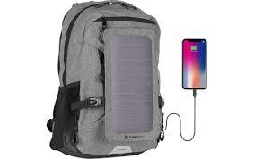

---

## Page 37

Le MVP – Suite et fin
   > Avantages & Limites :

    ➢ Le MVP, combiné à d’autres outils, permet de tester un marché avant de
      se lancer pleinement en minimisant les risques.

    ➢ Un MVP n’est pas une version 'low cost' de votre produit final. C’est un outil
      pour apprendre. Exemple : Dropbox a commencé par une vidéo de
      démonstration (sans produit réel) pour valider la demande.

     Avantages                                     Limites
                                                   - Peut donner une mauvaise image si trop
     - Réduit les coûts et les risques.
                                                   "low cost".
                                                   - Nécessite de bien choisir l’hypothèse à
     - Permet des itérations rapides.
                                                   tester.
                                                   - Certains marchés (ex : santé) ne
     - Valide la demande réelle.
                                                   permettent pas de MVP "light".

---

## Page 38

La Validation : Le Sondage
  > Les bonnes questions pour valider votre idée:
      Questions à éviter (réponses biaisées) :

   "Est-ce que vous aimez mon idée ?" → Tout le monde dit "oui".
   "Achèteriez-vous ce produit ?" → Réponse théorique ≠ achat réel.

      Questions efficaces (réponses actionnables) :

   "Combien avez-vous dépensé pour résoudre ce problème le mois dernier ?" → Mesure la
   douleur.
   "Quelle est la pire partie de [problème X] pour vous ?" → Identifie les pain points (freins).
   "Si ce produit existait, combien seriez-vous prêt à payer ?" → Teste le prix.

   Exemple pour SunPack :

   Mauvaise question : "Aimeriez-vous un sac à dos solaire ?" → 90% répondent "oui".
   Bonne question : "Combien avez-vous dépensé en batteries externes l’an dernier ?"
   → Réponse moyenne : 80€ → Potentiel marché.

   ❖ Note : En amont du sondage, il faut identifier votre cible le plus précisément possible
      → segmenter le marché en petits groupes homogènes en fonction de leurs

---

## Page 39

PHASE
 PHASE1 4: :
LE
 CONCLUSION
DIAGNOSTIC

---

## Page 40

  Récapitulatif des solutions proposées
             > Choisir la matrice la plus adaptée en fonction de vos besoins
         ➢ Matrices & Outils : Le bon outil au bon moment

Stade du                                         Outil
                  Objectif principal                              Pourquoi ?                                        Exemple (SunPack)
projet                                           recommandé
                                                                                                                    "Le marché des sacs solaires est-il
                                                                  - Identifier les forces/faiblesses internes.
Idée / Concept    Valider l’opportunité marché   SWOT                                                               porteur ? Quels sont nos atouts face à
                                                                  - Analyser les opportunités/menaces externes.
                                                                                                                    la concurrence ?"
                                                                  - Évaluer le potentiel de croissance et la part
                                                                                                                    "Notre gamme 'SunPack Lite' est-elle
                  Hiérarchiser les risques       Matrice BCG      de marché.
                                                                                                                    un 'Dilemme' ou un 'Poids mort' ?"
                                                                  - Décider d’investir ou d’abandonner.
                  Structurer le modèle           Business Model   - Clarifier la proposition de valeur, les         "Comment monétiser SunPack ? Qui
Validation
                  économique                     Canvas           segments clients, et les flux de revenus.         sont nos clients cibles ?"
                                                                                                                    "Les randonneurs paieraient-ils 200€
                  Tester une hypothèse clé                        - Valider la demande ou une fonctionnalité
Prototypage                                      MVP                                                                pour un sac solaire ?" (landing page +
                  avec peu de ressources                          avant de développer le produit final.
                                                                                                                    pré-commandes)
                  Affiner la stratégie                            - Combiner analyse interne/externe (SWOT)         "Quels canaux de distribution prioriser
Lancement                                        SWOT + BMC
                  commerciale                                     et modèle économique (BMC).                       ? Comment réduire les coûts ?"
                                                                  - Identifier les produits "Vedettes" à            "Faut-il investir dans la gamme
                  Optimiser le portefeuille de
Croissance                                       Matrice BCG      développer et les "Poids morts" à                 'SunPack Pro' ou arrêter 'SunPack
                  produits
                                                                  abandonner.                                       Kids' ?"

---

## Page 41

Récapitulatif des solutions proposées
   > Choisir la matrice la plus adaptée en fonction de vos besoins
  ➢ Matrices & Outils : Le bon outil au bon moment

  Votre projet en est à : Idée / Concept → Allez au SWOT ou BCG.

  Validation → Allez au BMC ou MVP.

  Prototypage → Allez au MVP.

  Lancement/Croissance → Combinez SWOT + BMC ou BCG.

  Votre objectif est de : Mieux comprendre le marché → SWOT.

  Hiérarchiser les investissements → BCG.

  Structurer votre modèle économique → BMC.

  Tester une hypothèse rapidement → MVP.

  * A noter que certains outils comme le SWOT sont utiles à plusieurs stades et répondent à plusieurs besoins.

---

## Page 42

Votre Check-list : Go / No-Go
  > 3 questions pour décider de lancer (ou pas)

  ➢ Problème : Est-ce que je résous un problème douloureux pour ma cible ?
  ➢ (Ex : Les randonneurs ‘perdent’ leur téléphone en montagne.)

  ➢ Marché : Ma cible est-elle identifiable et accessible ?
  ➢ (Ex : Les randonneurs achètent sur Amazon et forums spécialisés.)

  ➢ MVP : Mon prototype teste-t-il ma valeur ajoutée ?
  ➢ (Ex : Un sac avec panneau solaire + batterie, sans design final.)

---

## Page 43

Dernières Remarques
  > Transformer l’idée en prototype

  ➢ Ne pas brûler les étapes !

  ➢ Prenez le temps de bien étudier vos concurrents (y compris indirects).

  ➢ Prenez le temps d’étudier vos cibles, leurs besoins, leurs freins.

  ➢ Quelles sont leurs caractéristiques démographiques/géographiques,
     comportementales et psychographiques ?

  ➢ Soyez des ingénieurs qui créent de la valeur

  ➢ Place aux questions… et à vos projets !

---

## Page 44

                                           Tech Day
                                                Mercredi 12 Juin 2024

    Une question ? Contactez nous – RDV –
sur la HOTLINE RESCUE -    TEAMS

Olivier Girinsky – RESP. PÔLE EXPERTISES PROJETS TRANSVERSES olivier.girinsky@efrei.fr

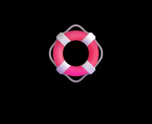

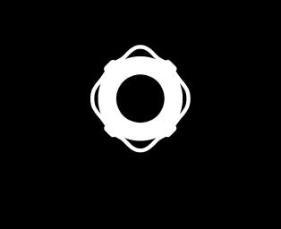

