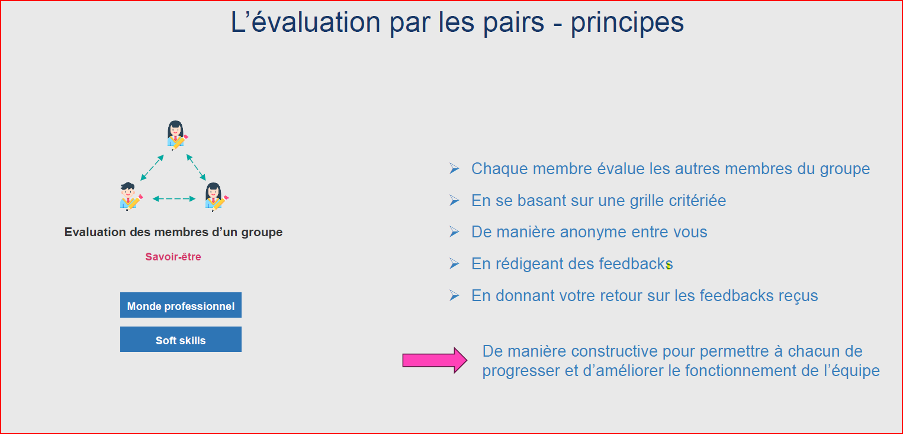
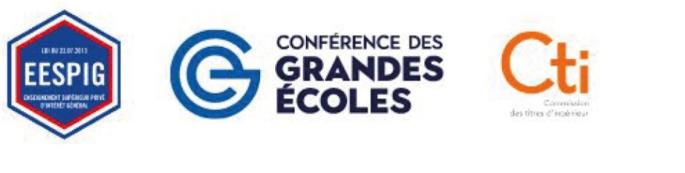
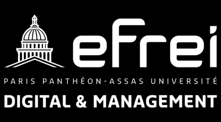
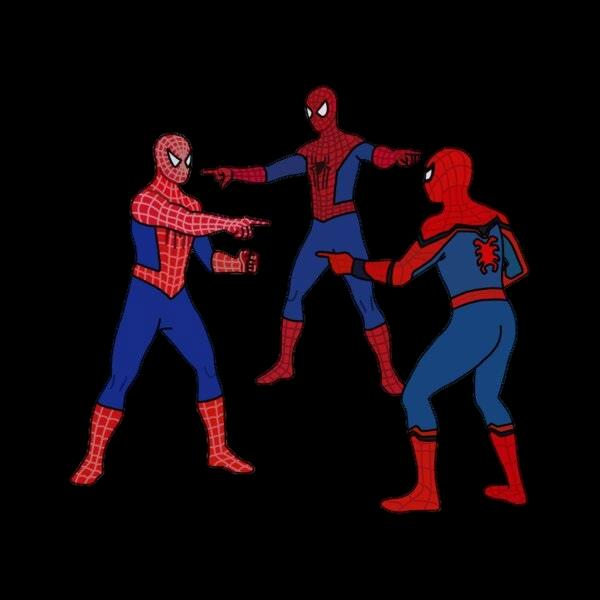
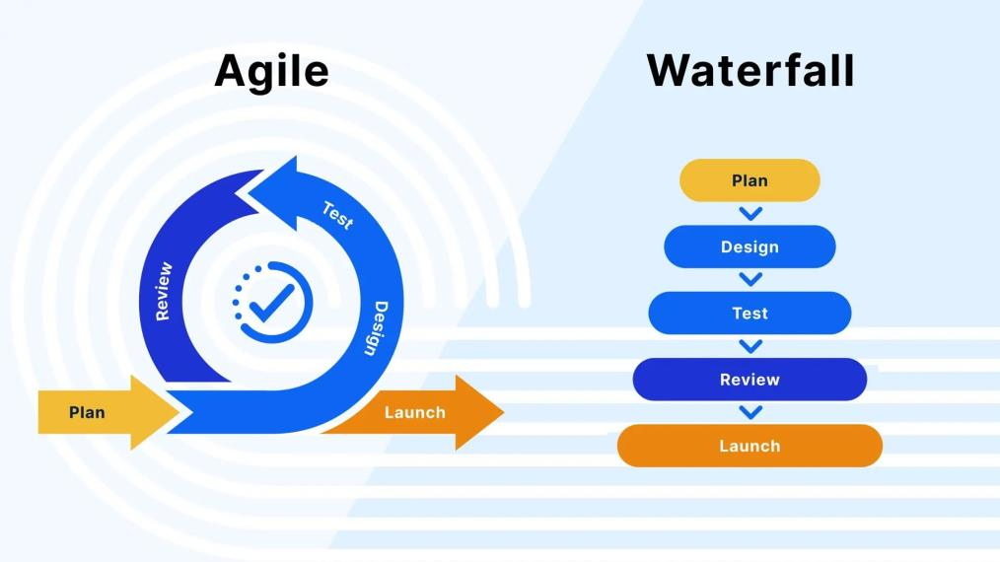
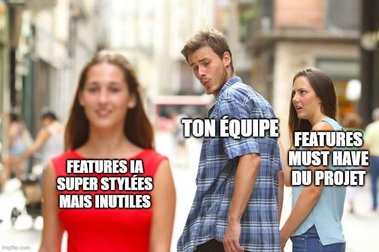
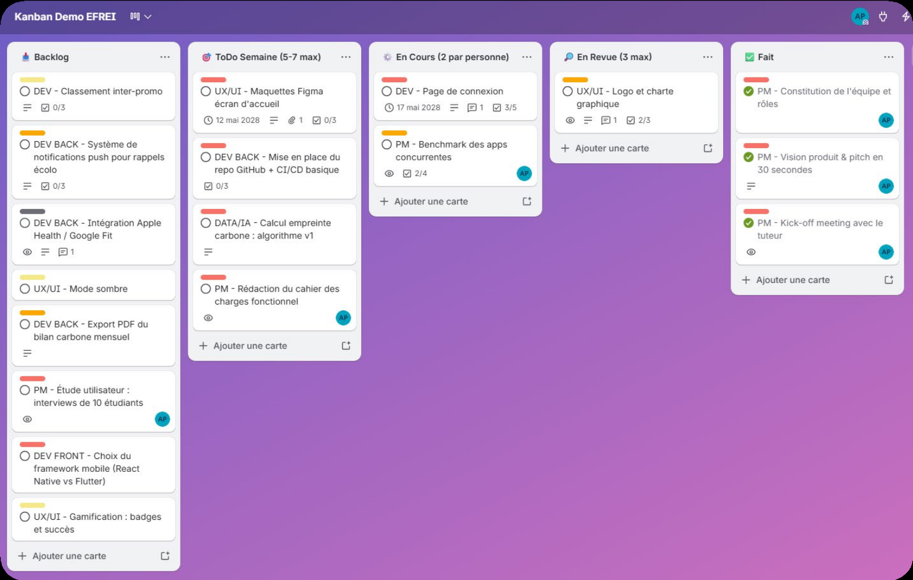
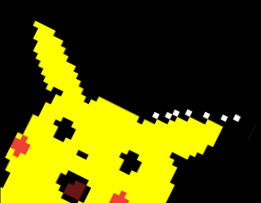
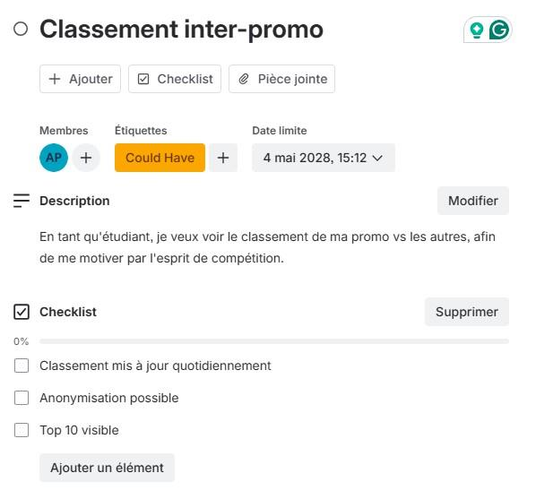

# Focus 3 — Vision Produit

_Source : `efrei/_raw/focus-3.pdf`_

_26 pages._

---

## Page 1

                    Projets Transverses- PGE

INNOVATION PROJECTS – 25/26
        FOCUS N°3
Pourquoi parler de vision produit ?- Piloter du projet au prototype
                            PPE-ING 2

                          2025-2026

---

## Page 2

                    Projets Transverses- PGE

INNOVATION PROJECTS – 25/26
        FOCUS N°3
Pourquoi parler de vision produit ?- Piloter du projet au prototype
                            PPE-ING 2

                          2025-2026

---

## Page 3

             Sommaire

1. Rappels des attendus

2. Piloter du projet au prototype

---

## Page 4

           Innovation Projects-Evaluation –
                      15 mai
L’évaluation par les pairs – Pour quoi ?
• Un projet se mène en groupe

• Le projet a besoin des compétences de chacun des membres pour réussir

• Il est nécessaire de faire des ajustements pour chacun s’implique pleinement dans le projet

• Un ingénieur doit pouvoir exprimer ses attentes envers ses équipes et recevoir celles
  autres pour permettre à l’équipe de fonctionner le mieux possible.

                      Savoir donner et recevoir des feedbacks sur les membres
                         de son équipe pour améliorer son fonctionnement

---

## Page 5

---

## Page 6

             Sommaire

1. Rappels des attendus

2. Piloter du projet au prototype

---

## Page 7

                                                                Innovation Project -
                                                                 Tips and Tricks
                                   Activités:    Focus thématique de 9 h15 à 10 h
                                                                                    Hotline                                                   Format
Dates Jour Mois   Séquencement                                                    Rescure sur Activités de l’équipe
                                   en distanciel
                                                                                  Teams                                           8 focus en distanciel de 50 min
6 au              Pré                                                                          Candidatez en équipe via le lien
10
     4    Avril
                  enregistrement
                                   Candidature des équipes
                                                                                               Calendly                              entre 9H10 approx 10H00
                  Cahier des                                                                   Disponible pour RDV Déposant &
10   V    Avril                    Kick-Off -
                  charges                                                                      Mentor
                  Cahier des       Focus 1 : Réaliser un Etat de l’art/ Veille                 Disponible pour RDV Déposant &
20   L    Avril
                  charges          scientifique et technique                                   Mentor
                  Cahier des       Focus 2 : Pourquoi un ingénieur doit penser                 Disponible pour RDV Déposant &
27   L    Avril
                  charges          “marché” ?                                                  Mentor
                  Cahier des                                                                   Disponible pour RDV Déposant &
4    L    Mai                      Focus 3: Pourquoi parler de vision produit ?
                  charges                                                                      Mentor

                  Phase de         Focus 4 : Pourquoi l’innovation sans veille est             Disponible pour RDV Déposant &
15   V    Mai
                  réalisation      une reproduction inconsciente ?                             Mentor

18   L    Mai
                  Phase de
                  réalisation
                                   Focus 5 : Eco - conception/ Green It
                                                                                               Disponible pour RDV Déposant &
                                                                                               Mentor
                                                                                                                                    POP UP GUEST
3    M    Juin
                  Phase de
                  réalisation
                                   Focus 6 : Création d’un Poster dans les
                                   règles de l’art
                                                                                               Disponible pour RDV Déposant &
                                                                                               Mentor
                                                                                                                                     20 min Retex –
12   V    Juin
                  Phase de
                  réalisation
                  Phase de
                                   Focus 7 : Preuve de concept / TRL
                                                                                               Disponible pour RDV Déposant &
                                                                                               Mento
                                                                                               Disponible pour RDV Déposant &
                                                                                                                                      20 min Q&R
17   M    Juin                     Focus 8 : Bien préparer sa Démo
                  réalisation                                                                  Mento
                  Phase de         Focus 9 : Quand est-ce que le projet sera                   Disponible pour RDV Déposant &
22   L    Juin
                  réalisation      terminé ?                                                   Mento
                  Phase de                                                                     Disponible pour RDV Déposant &
2    J    Juillet                  Soutenance -Blanche- Factory
                  réalisation                                                                  Mento
                  Soutenance-
3    V    Juillet Poster-Prize     Soutenances- Bat New Republic
                  Demo
16   J    Juillet Poster-Prize     Poster-Prize Campus

---

## Page 8

                             Vision produit « Piloter du projet au
                                        prototype »

        Intervention de
        Alexis Parsat
           Lacoste

Comment transformer une idée technique en               Alexis PARSAT LACOSTE
   produit cohérent, priorisé et livrable              alexis.parsat-lacoste@efrei.fr

---

## Page 9

    VISION PRODUIT
    >Pilotez votre projet de la vision au prototype.

2ème Année
Cycle Ingénieur

---

## Page 10

Alexis Parsat-Lacoste

   Enseignant Permanent à Bordeaux

   Domaines d'enseignement
> Product Management   > Management d'Équipes
> Gestion de Projet    > Stratégie Marketing Digital

   alexis.parsat-lacoste@efrei.fr

---

## Page 11

H
e
l   > De l'idée au MVP avec Kanban & Trello

l
o
W
                   Qui a déjà vu un projet d'équipe partir
o                  en vrille faute d'organisation ?
r                  (C'est une question rhétorique)

l
d

---

## Page 12

O
b
j   > Ce que vous saurez faire dans 20 minutes

e
c
t      Définir une Vision Produit claire.

i      Comprendre Kanban pour fluidifier le travail.

f      Formuler vos tâches en User Stories.

d      Prioriser votre MVP avec MoSCoW.

e      Configurer un board Trello opérationnel.

l
a

---

## Page 13

1
.
L     > The Usual Suspects

e
s   LES TÂCHES FLOUES : "Faire le rapport", "Coder l'app"
y
n   LES TÂCHES FAITES EN DOUBLE (ou oubliées…)

d   L'EFFET TUNNEL : On percute au moment de livrer….
r
o   LA QUESTION QUI TUE : "Au fait, qui fait quoi ?"

m
e

---

## Page 14

2
.
L         > On souffle un grand coup et on reprend la base !

a
V      A quoi ça sert ?

i   Votre vision produit vous permet de transformer une idée
    technique en véritable produit cohérent et utilisable.

s
i      Exemple de modèle

        "Pour [persona], qui [ont ce problème], notre projet
o       est [une solution] qui apporte [bénéfice clé]."
                                                                 PAS DE VISION : PAS DE DIRECTION,
n       "Pour [les audiophiles], qui [entendent une musique
        inconnue], notre projet est [une app de reconnaissance
                                                                 PAS DE DIRECTION : PAS DE PRODUIT,
                                                                 PAS DE PRODUIT… PAS DE PRODUIT.
P       audio] qui apporte [le nom en quelques secondes]."

r

---

## Page 15

3
.
M         > La querelle des anciens et des modernes

é
t      Modèles Classique : Prédire
h   On planifie tout, puis on exécute. Risque =>Le besoin change.

o   Modèles classiques : Waterfall ou Cycle en V.

d
e      Modèles Agiles : Itérer

        Framework Scrum : Sprints cadencés (ex: 2 semaines).
s
        Méthode Kanban : Flux continu (idéal pour vous).
C
l

---

## Page 16

4
.
K          > Entre Tradition & Modernité…

a
n      Années 1950
b   Inventé par Toyota (Taiichi Ohno) pour ses usines automobiles.
a
        Années 2010
n
    Adapté à l'ingénierie logicielle par David J. Anderson.
,
ç       Le Postulat

    Rendre le travail intellectuel visible pour identifier les blocages.
a
v

---

## Page 17

5
.
L         > Et si on arrêtait d'arrêter ?

e
s      1. Visualiser le flux de travail
3   Un tableau clair, avec des colonnes se lisant de gauche à droite.
p
       2. Limiter le travail en cours (WIP)
r
    La règle d'or "Arrêtez de commencer, commencez à finir".
i
n      3. Améliorer en continu

    Ajustez le tableau selon vos besoins.
c
i

---

## Page 18

6
.
D         > Les User Story

e
l      Le format User Story

a   "En tant que [rôle], je veux [action] afin de [bénéfice]."
                                                                   Slt Enzo, tu peux dev le site stp?

v      Exemple
                                                                   Pour demain si tu peux. Bisous.

i           "Faire la page d'accueil avec une vidéo sur le hero"

s           "En tant que membre du jury, je veux voir une démo
            vidéo afin de comprendre le prototype en 30s."
i      Bonus : les critères d'acceptation
o   La tâche est finie seulement si...

n

---

## Page 19

7
.
P         > MoSCoW

r
i          M - Must have

o   Les features de votre MVP. Sans ça, le projet échoue.

r          S - Should have

    Les features importantes, mais sacrifiables.
i
           C - Could have
s   Les features bonus, si on a le temps.

e          W - Won't have

r   Les features exclues pour cette fois-ci.

p

---

## Page 20

8
.
O   > Pourquoi utiliser Trello pour vos projets ?

u
t
i      Gratuit et collaboratif en temps réel.

l      Prêt à l'emploi pour du Kanban.

:      Zéro friction, courbe d'apprentissage de 2 minutes..
                                                              https://trello.com/

T
       Alternatives : Notion, Jira, GitHub Projects.
r
e
l

---

## Page 21

   C'est de
toute beauté !
                    Kanban Board de Démo Publique
                 https://trello.com/b/lsIVbc77/kanban-demo

---

## Page 22

8
.
O   > Remplir vos cartes (sans usine à gaz)

u
t      Nom : Dénomination courte de la carte / tâche.

i      Membres : Un seul responsable principal par carte.

l     Etiquettes : Utilisez-les pour la priorisation MoSCoW.
:
      Date Limite : Pour afficher des deadlines.
T
r     Description : Utilisez-la pour décrire votre User Story.

e     Checklist : Pour vos critères d'acceptation de la US.

l

---

## Page 23

9
.
C         > Des réunion / visios courtes et impactantes

o
m      Le Stand-up (10 min, 2x/semaine)

m   Chacun répond à ces trois questions :

u   - Qu'est-ce que j'ai fait ?
    - Que vais-je faire ?
    - Qu'est-ce qui me bloque ?
n
i      La revue de board (Hebdomadaire)

    On nettoie les colonnes, on repriorise le Backlog.
c
a             WeLL aCtuALLy…
              Kanban et Scrum on en réalité des réunions plus codifiées,
t             il s'agit ici d'une version plus simple et accessible.

---

## Page 24

•1
⃣

C    Vos next steps
r
é    > Ce soir, je compte sur vous !
e
z
u
n
b
o
a
r
d
T
r
e
l
l
o
p
a
r
t

---

## Page 25

       MERCI,
VOUS AVEZ ÉTÉ BONS !

          (J'IMAGINE)

 alexis.parsat-lacoste@efrei.fr

---

## Page 26

                                           Tech Day
                                                Mercredi 12 Juin 2024

    Une question ? Contactez nous – RDV –
sur la HOTLINE RESCUE -    TEAMS

Olivier Girinsky – RESP. PÔLE EXPERTISES PROJETS TRANSVERSES olivier.girinsky@efrei.fr

