# Focus 4 — Sketchnote & Business Model

_Source : `efrei/_raw/focus-4.pdf`_

_27 pages._

---

## Page 1

         Projets Transverses- PGE

INNOVATION PROJECTS – 25/26
        FOCUS N°4
        Sketchnote & business model
                 PPE-ING 2

               2025-2026

---

## Page 2

         Projets Transverses- PGE

INNOVATION PROJECTS – 25/26
        FOCUS N°4
        Sketchnote & business model
                 PPE-ING 2

               2025-2026

---

## Page 3

     Breaking news
Evaluation par les pairs
  Du 15 au 18 mai

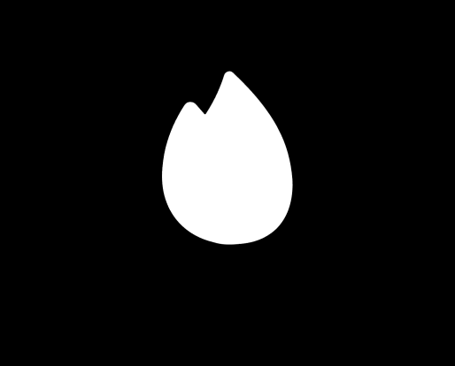

---

## Page 4

Dans ce focus, nous verrons comment le sketchnote permet de transformer n’importe quel modèle
complexe — technique, organisationnel, data, architecture, ou métier — en image mentale claire.

Pour un ingénieur du numérique, c’est un atout majeur : le visuel accélère la compréhension, facilite
la collaboration avec les équipes non techniques et rend immédiats les points à tester, à sécuriser ou
à optimiser.

Le sketchnote met aussi en évidence les dépendances, les risques, les choix d’architecture et les
hypothèses projet. C’est une façon simple et rapide de faire converger une équipe, préparer une
soutenance interne, aligner un comité métier ou structurer un sprint.

---

## Page 5

  Est-ce que l’être humain
mémorise plus facilement les
   images OU les mots ?

---

## Page 6

 er
1 Skechtnoteur ?

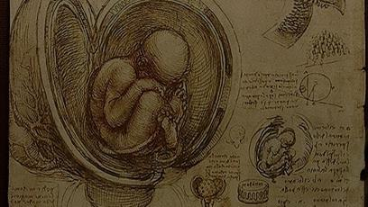

---

## Page 7

 « Skechtnoting »

      Représenter
    visuellement des
informations complexes

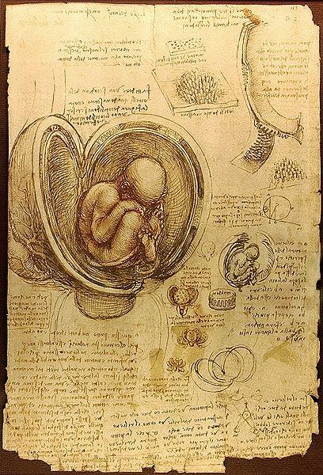

---

## Page 8

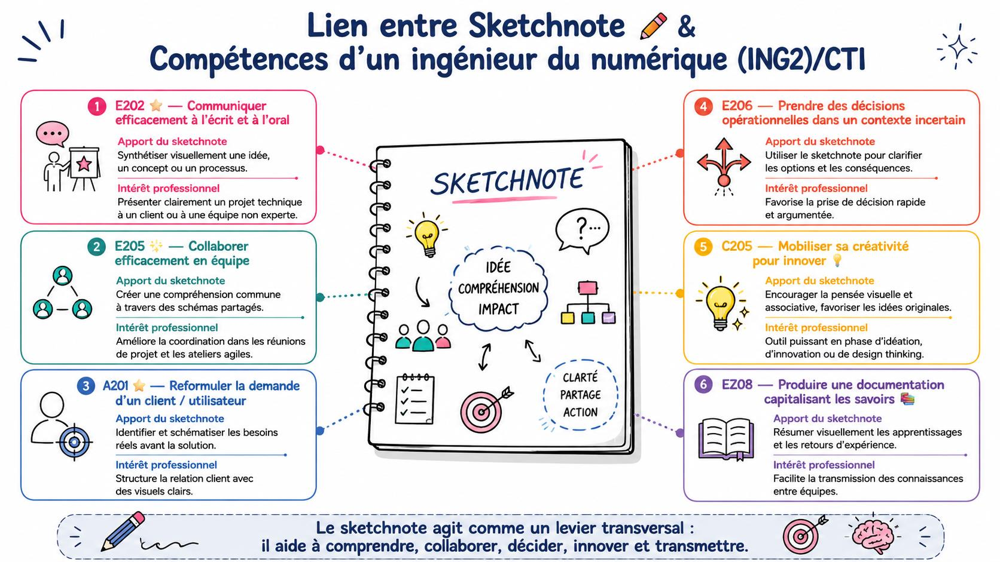

---

## Page 9

                                             Sketchnote & Efficacité Cognitive —
                                                  Synthèse scientifique
Mécanisme cognitif / effet                                                                                            Impact professionnel (ingénieur du
                                Description scientifique                     Références principales
observé                                                                                                               numérique)
                                L’information est mieux mémorisée                                                     Favorise la rétention et la
                                                                             Allan Paivio, 1986 ; Csachová &
   Théorie du double codage     lorsqu’elle est traitée simultanément par                                             compréhension de concepts
                                                                             Kidonová, 2022 – EU Journal of
(Dual-Coding Theory)            les canaux verbal (texte, mots) et visuel                                             techniques complexes (ex. architecture
                                                                             Educational Research
                                (images, schémas).                                                                    système, protocole réseau).
                                Les images et icônes sont plus facilement
                                                                           Nelson, Reed & Walling, 1976 ;             Améliore la restitution en soutenance
   Picture Superiority Effect   mémorisées que les mots seuls, car elles
                                                                           Bratash et al., 2020 – Frontiers in        ou lors d’un audit projet, même après
(supériorité de l’image)        créent des traces mnésiques plus riches et
                                                                           Psychology                                 plusieurs semaines.
                                distinctes.
                                Le cerveau traite simultanément texte et     Baddeley, 1992 – Working Memory
                                                                                                                      Facilite la compréhension rapide
   Réduction de la charge       visuel via deux sous-systèmes (boucle        Model ; Kalil, 2020 – Effectiveness of
                                                                                                                      d’informations multi-sources
cognitive                       phonologique + calepin visuo-spatial).       Sketchnotes in Developing Cognitive
                                                                                                                      (documents techniques, slides, logs…).
                                Cela diminue la surcharge d’un seul canal.   Skills
                                                                                                                    Renforce la compréhension
                                Le sketchnote implique de sélectionner,      Fiorella & Mayer, 2015 – Learning as a
   Traitement actif /                                                                                               conceptuelle et la capacité à reformuler
                                reformuler et représenter les idées :        Generative Activity ; Csachová &
métacognitif                                                                                                        lors de briefings ou de synthèses
                                l’apprenant devient auteur, pas copiste.     Kidonová, 2022
                                                                                                                    d’incident.
                                Les représentations visuelles (flèches,
                                                                                                                      Facilite la collaboration internationale :
    Universalité visuelle       icônes, structures) activent des processus   Bratash et al., 2020 ; Mayer, 2009 –
                                                                                                                      langage visuel partagé en réunion
interculturelle                 cognitifs universels, indépendants de la     Multimedia Learning Theory
                                                                                                                      multi-culturelle.
                                langue.
                                Le sketchnote met en évidence les liens,
                                                                                                                      Améliore la capacité à représenter un
   Structuration et pensée      dépendances et priorités ; il favorise la
                                                                             Kalil, 2020 ; EU-JER 2022                système complexe (IoT, réseaux, data-
systémique                      vision d’ensemble et la compréhension
                                                                                                                      flow).
                                système.
                           Le cerveau retient mieux ce qui est à la fois                                              Améliore les soutenances,
                                                                             Dual Coding + Picture Superiority +
   Communication mémorable vu, entendu et schématisé ; l’empreinte                                                    présentations client, management
                                                                             Mayer 2009
                           mnésique est multisensorielle.                                                             visuel et pédagogie technique.

---

## Page 10

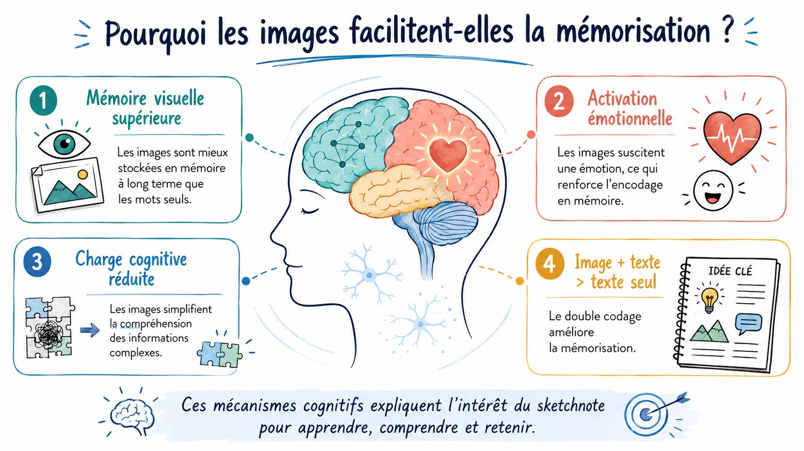

---

## Page 11

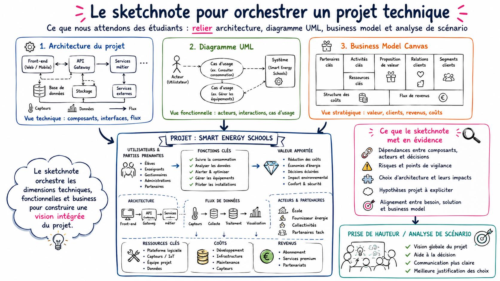

---

## Page 12

Let’s start

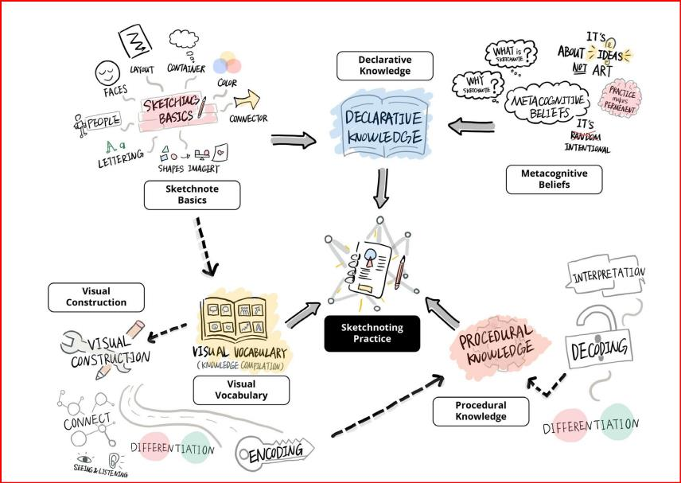

---

## Page 13

                   Pour une poignée de $...

 Intervention de
 Andréas TOPP

Comment passer de la pensée                          Andréas TOPP
  système de l’ingénieur au                andreas.topp@intervenants.efrei.net

      Business Model ?               Founder at Lagundo & Co-Founder at CapSan
                                   Innovation project tutor & consultant at Efrei Paris

---

## Page 14

  Pour une poignée de $...
Quand on crée un nouveau produit /service, il faut répondre à 3 questions
avant de pouvoir réfléchir aux revenus:
                                                                               *Attention, la Q4 se pose, un peu différemment,
         Q1        Qui sont les principaux utilisateurs ?                      dans tous les contextes…
                                                                               Quelques exemples…
         Q2        Qui sont les principaux clients ?
         Q3        Quelle est la valeur ajoutée pour eux ?                     Entreprenariat: Qu’est-ce qu’on va facturer?
                                                                               Projet interne entreprise:
Ensuite se posent les deux questions qui décident de la pérennité du projet…   Quel budget va financer ce projet ?
          Q4        Comment générer des revenus ?*                             Association: Qui va financer le fonctionnement?
          Q5        Quelles sont les sources de coût ?
                                                                               Et en superposant les conclusions de Q4 et Q5…

Pendant les 4 premières phases du cycle de vie, les problématiques et          Entreprenariat: Est-ce qu’on va être rentable ?
priorités changent…                                                            Projet interne entreprise :
           Phase 1 – création de la V1 des produits et services                Quel est le retour sur investissement ?
                                                                               Association: Est-ce que le coût récurrent du projet
           Phase 2 – lancement commercial                                      s’autofinance à terme, si non, quel est le ratio impact
           Phase 3 – croissance                                                budget – utilité ?
           Phase 4 – vitesse de croisière
Le grand enjeu est de démontrer dès le début qu’on peut être rentable en
phase 4…
sinon, habituellement, personne ne va financer les phases 1->3…
Se pose donc la question…
           Q6        Comment financer les phases 1-3 ?

---

## Page 15

Pour une poignée de $...
  Q1   Qui sont les principaux utilisateurs ?
                                                                       Bien sûr, parfois les Q1 & Q2 peuvent en devenir une
       = ceux qui utilisent, données statistiques (#, age,             seule… notamment en B2C
       répartition géo,…) profils socio-économiques (éducation,
       revenus, postes…), profils tech (habitudes, consommation,       L’important est d’identifier les paramètres qui peuvent
                                                                       influer sur la définition du produit/service et la
       connaissances),…                                                manière de vendre… A chaque projet ses paramètres…

  Q2   Qui sont les principaux clients ?                               Bien comprendre ses futurs utilisateurs et clients est
       = ceux qui paient, En B2B – analyse par secteur d’activité,     indispensable pour définir un produit/service qui sera
                                                                       facilement adapté et acheté.
       tailles, situation, qui dans l’entreprise est prescripteur,
       décideur, acheteur,…                                            Le besoin n’est pas qu’une liste de fonctionnalités.
       En B2C il n’y a pas toujours une distinction utilisateur –
                                                                       Ca influe non seulement sur les fonctionnalités et le
       client, mais…                                                   design, mais souvent aussi sur les choix
       Enfant – parent, Parent – enfant, cadeaux,…                     technologiques.

  Q3   Quelle est la valeur ajoutée pour eux ?
                                                                       Dans la mesure du possible il faut essayer de quantifier
       Qu’est-ce que votre offre apporte aux clients et
                                                                       ou sinon comparer avec des référentiels linguistiques.
       utilisateurs ? (Gain de temps, + accès à des infos, sécurité,
       économie, rencontres, communication, qualité                    Plus la VA est élevée, plus le client est prêt à payer et
       relationnelle, fun, santé,… comme la tech peut servir à         moins il va questionner votre façon de lui vendre votre
                                                                       produit/service…
       tout…)
                                                                       .

---

## Page 16

   Pour une poignée de $...
   Q4-Sources de revenus fréquentes dans les IT :

                                       Modèles de facturation fréquents
   Licences / saas                     (durée d’utilisation, nombre d’utilisateurs, de site, fonctionnalités,…)
   App                                 (achat, achat in-app, ceux des licences/saas,…)
   Usage                               (taux et temps d’utilisation, consommation,…)
   Services                            (études, personnalisation, installation, production, maintenance, formation,…)
   Publicité & Sponsoring              (Emplacement, taille, vues, clicks, visibilité événements, etc.)
   Subventions étatiques               (programmes d’investissements, priorités recherche, création d’emploi, apprentissage,…)

   Pour les associations et autres organismes sans but lucratif s’ajoutent à cela

   Adhésion association                (durée, statut de membre,…)
   Donations                           (possibilités de défiscalisation,…)

Quand il y a concurrence, le modèle de génération de revenus peut être une    Attention à ne pas créer des modèles trop compliqués !
manière de se différentier…
                                                                              Attention, dans la vraie vie ces choix peuvent complexifier le projet
Les prix qu’on cale sur le modèle dépendent de plein de paramètres – Valeur   énormément (besoin de tracer toute opération de chaque utilisateur
ajoutée, degré d’innovation, rareté, coût, moyens des clients,…               pour pouvoir facturer correctement par exemple…)

---

## Page 17

 Pour une poignée de $...
Q5-Sources de coût – quelques bases pour cette réflexion
                                                                             Ventes
                                                                             Canaux de ventes physique -> virtuel
Coût généré par la production du produit/service proposé
(en tenant compte du matériel, des services achetés, des rh nécessaires,     Acquisition de clients (Démarcher, Négocier,…)
de la consommation énergie, etc.…)                                           Gestion des ventes et paiements
                                                                             Livraisons, Sav, Fidélisation
Mise en route (Achats nécessaires, formation,…)
Production (tous ce qu’il faut pour faire marcher)                           Fonctionnement
Maintenance (tous ce qu’il faut pour assurer la                              Lieu de travail et équipements
continuité)                                                                  Services généraux - Compta, RH, juridique, IT,…
Évolution (tout ce qu’il faut pour assurer la pérennité)
                                                                             Coût marketing
 Evidemment dans le cadre d’un vrai projet de création ses réflexions et
 les analyses à faire prennent beaucoup de temps. En tout début de
                                                                             Communication tout canal (Web, média, événements, presse)
 projet, il suffit d’identifier en général de bien identifier les coûts de   Types de communication (Corporate, image, produit, vente)
 production. Mais, attention, cette analyse est de la plus haute             Gestion des produits/services (Evolution des specs des
 importance car elle peut profondément changer le produit… notamment         produits/services, Gestion du portefeuille de produits/services
 les choix techniques.
                                                                             Pricing)
 Souvent, la manière dont laquelle le produit arrive chez client est
 également très important à ce niveau (exigences des app stores par
 exemple…)
 Beaucoup de projets de start-ups se sont trouvés en difficulté par une
 sous-estimation des coûts quand la croissance arrive et une vision
 optimiste des besoins en force de vente et marketing pour pénétrer le
 marché. Résultat : beaucoup de projets n’arrivent pas en phase 4…

---

## Page 18

Pour une poignée de $...                           Business model skechtnote

Le business model sketchnote permet de visualiser en un coup d’œil les principaux enjeux business d’un projet
technique sur une feuille
                  1. Les différents blocs logiques sont à construire de manière visuelle (image)
                     avec le moins de texte possible.1-2 mots

                  2. Des synthèses des blocs « Génération de revenus » et « Principales sources
                     de coût » doivent être intégrées dans le sketchnote global

                                                                                Valeure
                Utilisateurs                     Client/acheteurs               ajoutée

          Principales méthodes            €                                 €             Principales sources de
            de génération de                         NOM Produit                                   coût
                 revenus

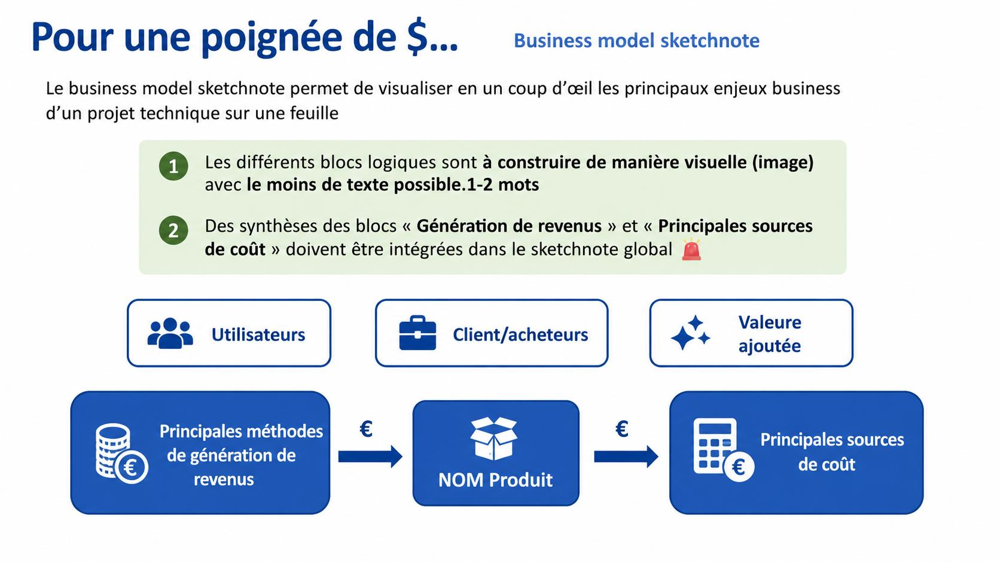

---

## Page 19

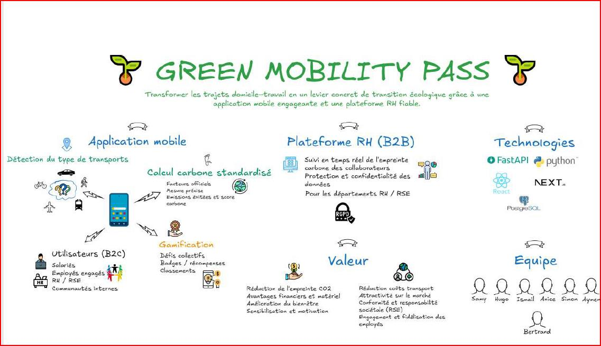

---

## Page 20

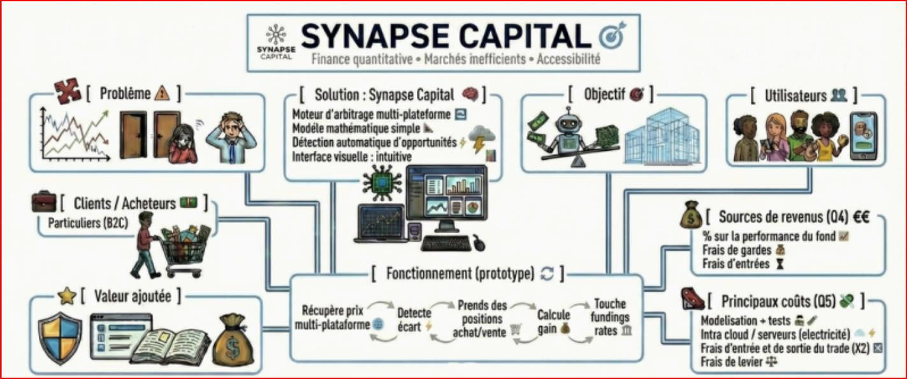

---

## Page 21

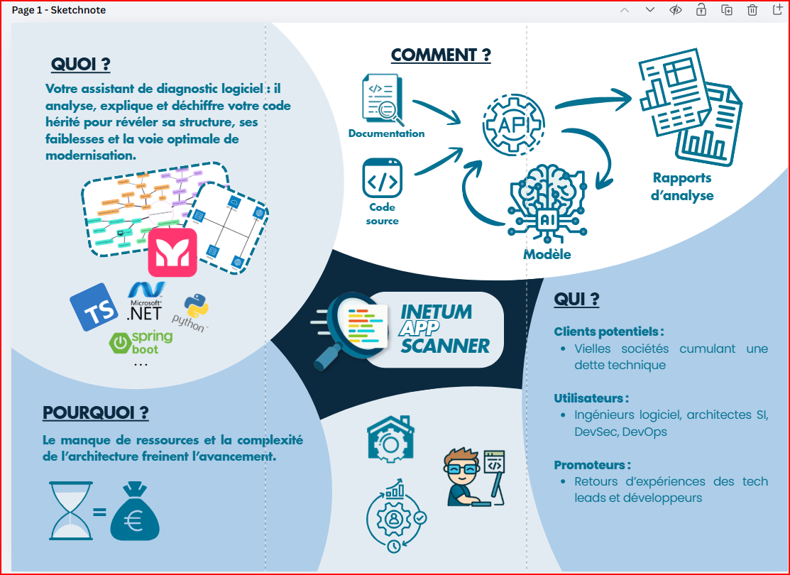

---

## Page 22

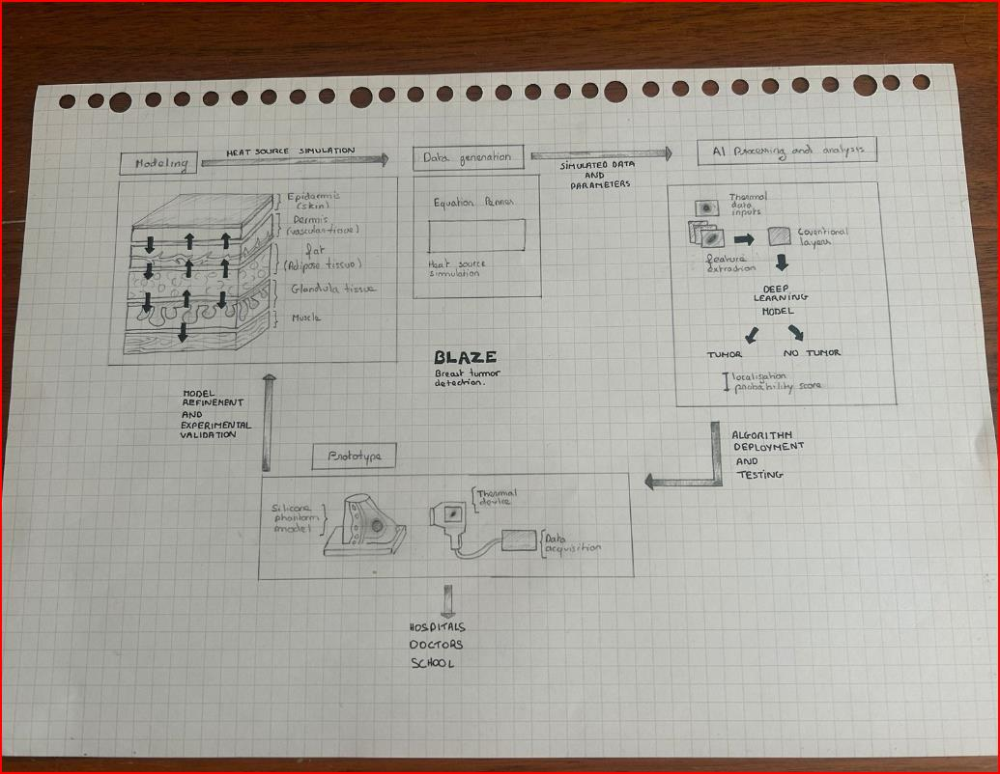

---

## Page 23

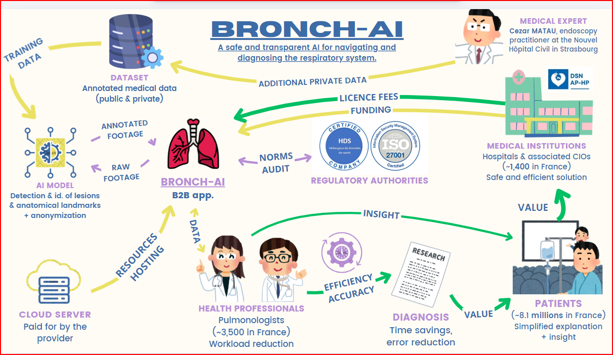

---

## Page 24

 inaliste du concours
  RA E 2 22 Le
numérique au service
de l rgence
Environnementale
Suivi Qualité IA
pour la lière
d entomoculture

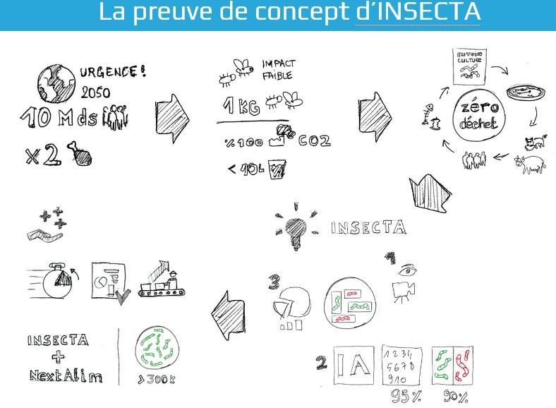

---

## Page 25

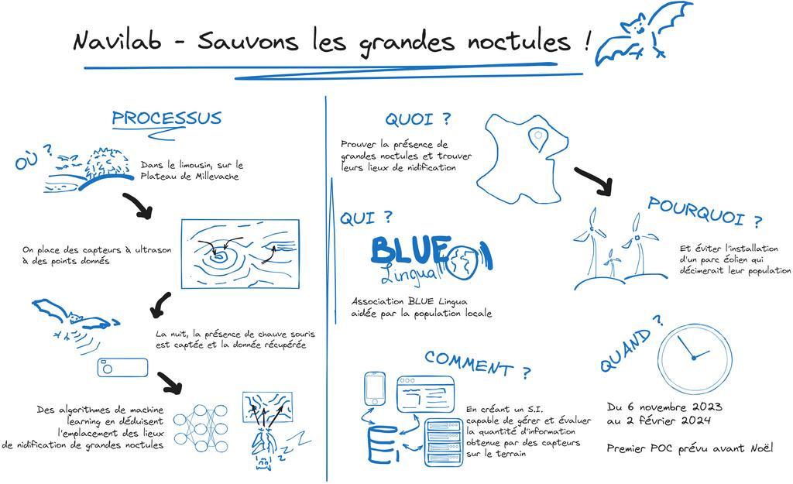

---

## Page 26

EFREI - Premier rendez-vous expert
                   Analyse du Projet : Identifier
                   les ressources, outils,
                   technologies, et utilisateurs.

                   Décomposer les Éléments :
                   Découper les composants pour
                   mieux comprendre les rouages.

                   Créer le Sketchnote : Visualiser
                   les éléments dans un format
                   graphique.

                   Contact Expert : Consulter Mr.
                   Andreas Topp pour développer
                   le business model.

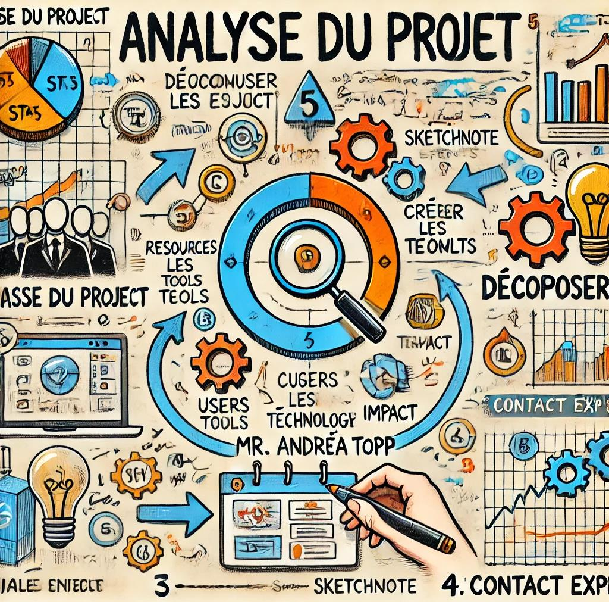

---

## Page 27

Merci pour votre attention… et bons projets !

