# Focus 5 — Veille Stratégique : Anticiper pour mieux innover

_Source : `efrei/_raw/focus-5-veille.pdf`_

_48 pages._

---

## Page 1

                 Projets Transverses- PGE

INNOVATION PROJECTS – 25/26
        FOCUS N°5
  VEILLE STRATÉGIQUE « Anticiper pour mieux innover »
                     PPE-ING 2

                       2025-2026

---

## Page 2

                 Projets Transverses- PGE

INNOVATION PROJECTS – 25/26
        FOCUS N°5
 VEILLE STRATÉGIQUE « Anticiper pour mieux innover »
                    PPE-ING 2

                       2025-2026

---

## Page 3

           Breaking news
Evaluation par les        1er RDV Expert
     pairs                  Sketchnote
Du 15 au 18 mai      Lien calendly sur Monday

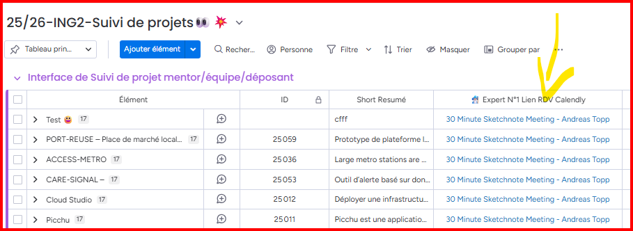

---

## Page 4

    Intervention de
Guillaume OUDENOT

      VEILLE STRATÉGIQUE
« Anticiper pour mieux innover »     Guillaume OUDENOT
                                   guillaume.oudenot@efrei.fr

---

## Page 5

Qui suis-je
?
              Guillaume OUDENOT
               Responsable département CMD

               Parcours

              > Directeur des programmes & Qualité – Haute École de Joaillerie
              > Directeur Pédagogique – ECV Digital
              > Directeur Général – Budd’it
              > Fondateur Directeur Conseil – IGO agence digitale
              > Directeur Associé - Longtail Value

               Guillaume.oudenot@efrei.fr

---

## Page 6

LA
VEILLE ?

---

## Page 7

ÊTRE …

         CURIEUX !

                     Image Square Space

---

## Page 8

       0. Apprendre à décrypter pour
            > L’INFORMATION EST UN POUVOIR
       comprendre
EuroSuit, quel équipement ?

Decathlon a développé une combinaison qui a été testée
par l’astronaute Sophie Adenot à bord de la Station
Spatiale Internationale (ISS) au printemps 2026 lors de la
mission EPSILON

Objectif pour Decathlon ?

Pas la Lune ! Mais moins de 2 MINUTES
Imaginer et concevoir les équipements intra véhiculaire de
protection et de confort des astronautes européens de demain*
                                                                   *20 Minutes – NOV 25
                                                                Cité de l’espace JANV 26

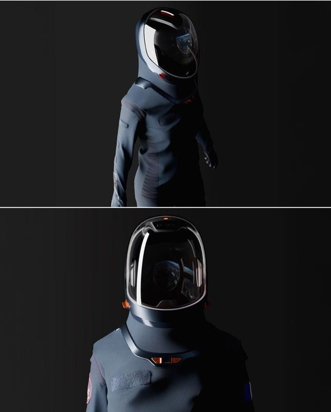

---

## Page 9

AVOIR
…
        1 ESPRIT
        CRITIQUE

              Image FIREFLY

---

## Page 10

  0. Apprendre à décrypter pour
    > LA DESINFORMATION EST UN POUVOIR
  comprendre

 LES FERMES
      À
                                         Ou comment manipuler le
SMARTPHONE                               cerveau des populations
                                         cibles …

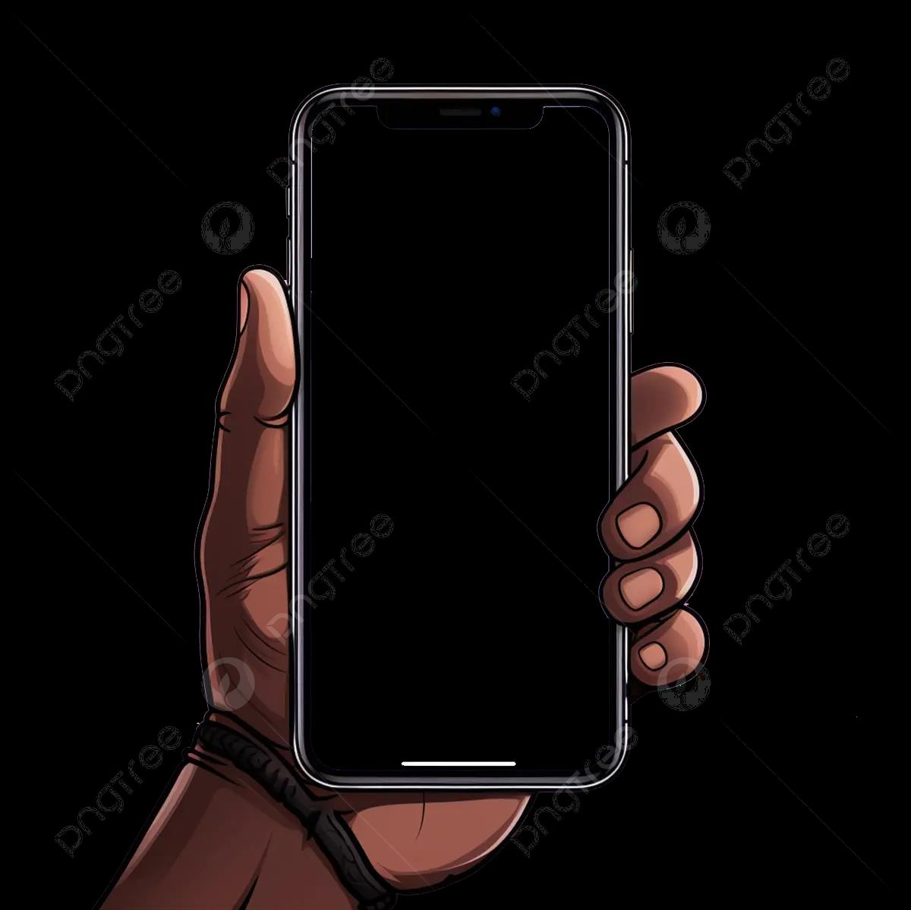

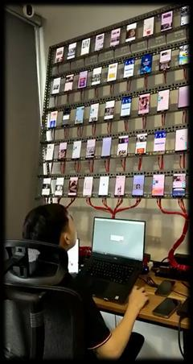

---

## Page 11

LA
VEILLE
STRATÉGI
QUE
•QUI RÉALISE 1
VEILLE SUR SON
PROJET ?

---

## Page 12

POURQUOI
LA VEILLE
EST STRATÉGIQUE ?

                    Norman Parkinson, britannique, photographe de mode (1913-1990). Jerry Hall, russia, Vo   e (diptych), 1975

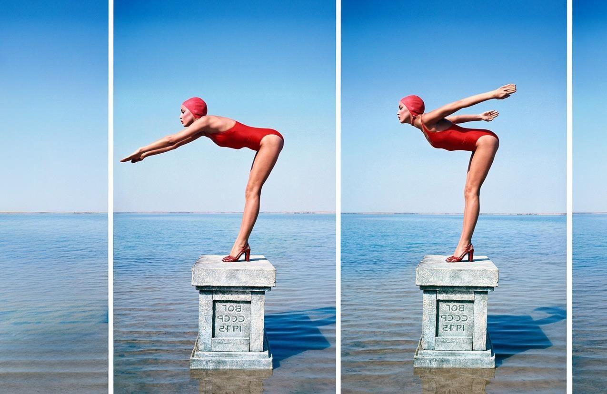

---

## Page 13

   Saviez-vous que  70%      des innovations
échouent parce qu’elles ne répondent pas à un
                   besoin réel
ou qu’elles existent déjà sous une autre forme ?

La veille STRATÉGIQUE permet d’éviter ce piège

---

## Page 14

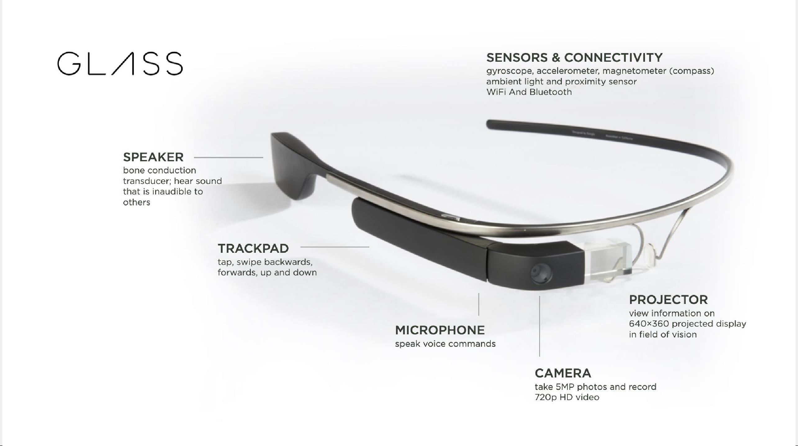

---

## Page 15

---

## Page 16

---

## Page 17

        Si un Business Angel vous demande :
      “COMBIEN DE FEMMES DIRIGENT
            DESENTREPRISES
             DU CAC 40 ?”

             4 femmes dirigent des groupes du CAC 40, soit 10 %
 Catherine            Christel                  Estelle            Hinda
MACGREGOR           HEYDEMANN                BRACHLIANOFF         GHARBI

---

## Page 18

TYPOLOGIES
DE
VEILLE

---

## Page 19

1
.
    > LES DIFFÉRENTES TYPOLOGIES DE VEILLE
L
a                            Outils d’aide à la décision
                             Notre projet est-il viable & répond t’il à des usages ?

v                            Donne des idées & oriente les choix

e                            Notre projet est-il innovant ? Les fonctionnalités ont-elles
                             une valeur ajoutée ?

i                            Anticipation dans un contexte d’activité
                             Notre projet est-il Leader ou Suiveur ?

l                            Vérification d’un environnement économique
l                            Y a - t - il des acheteurs potentiels de notre solution ?

e

---

## Page 20

1
.
                 > UN LEVIER D’INNOVATION
L         La VEILLESTRATÉGIQUE, c’est comme avoir un radar qui scanne en permanence

a         votre environnement (technologies, concurrents, réglementations…) pour détecter des
          opportunités avant les autres

v                              AVEC 3 ENJEUXCLÉSPOUR LESINGÉNIEURS
e
i
l           ÉVITER                                IDEN TIFIER                              RÉDUIRE
        LA DUP LICA TION                        DES TENDA NCES

l
                                                                                         LES RISQ UES

       Un étudiant qui a recréé un               Comment Tesla & BYD              Une startup peut éviter un procès

e
    algorithme existant sans le savoir      ont anticipé l’essor des véhicules   pour violation de brevet grâce à une
     (coût : 3 mois de travail perdus)        électriques grâce à la veille              veille technologique

---

## Page 21

1
.
    > LE CHIFFRE CLÉ
L      Selon une étude de l’INPI : (Institut National de la Propriété Industrielle)
a
v
e                                      30 %
i                      Brevet A                               Brevet A

l                           Brevet A

                                          Brevet A
                                                         Brevet A

l     des dépôts de brevets sont des doublons… faute de veille !
e                                                                                     https://www.inpi.fr/

---

## Page 22

1
.
    > LES DANGERS DE NÉGLIGENCE
L    Pourquoi l’innovation sans veille est une reproduction inconsciente ?
a
v     RISQUE # 1                     RISQUE # 2                     RISQUE # 3

e   Perte de temps et
         d’argent
                                Contraintes juridiques          Manque d’originalité

i
l    PROTOTYPE
     ABANDONNÉ
                                BREVETS, NORMES,
                                   PLAGIAT …
                                                               PROJET « ME TOO »
                                                                PEU COMPÉTITIF

l
     Qui parmi vous a déjà eu une idée et découvert après qu’elle existait déjà ?
e

---

## Page 23

SANS VEILLE, VOUS
PARTEZ DE ZÉRO…

OU PIRE, VOUS
RÉINVENTEZ LA ROUE
SANS LE SAVOIR !

---

## Page 24

2
.
    > LES DIFFÉRENTES TYPOLOGIES DE VEILLE
L
a
                             Surveillance des activités des concurrents
v
                             Exploration de son marché
e
                             Anticipation dans un contexte de nouveau produit
i
l                            Analyse des évolutions marketing

l
e

---

## Page 25

•D
3
é
t.
           > LES DIFFÉRENTES TYPOLOGIES DE VEILLE
 e
 L
 c
 ta
  e
  vr
   le
    e
    is
     a
     lv
      la
       n
       e
       c

---

## Page 26

4
.
    > LES DIFFÉRENTES TYPOLOGIES DE VEILLE
L
a
                             Analyse des besoins clients
v
                             Surveillance santé financière fournisseurs
e
                             Anticipation sur la valeur des prospects
i
l                            Suivi des actions des concurrents

l
e

---

## Page 27

5
.
    > LES DIFFÉRENTES TYPOLOGIES DE VEILLE
L
a
                             Identifier les réformes & les normes
v
                             Réduire les risques & améliorer la qualité
e
                             Anticiper réglementations nationales & internationales
i
                             Être en conformité avec la loi selon ses activités
l
l
e

---

## Page 28

•S
6
u
r.
          > LES DIFFÉRENTES TYPOLOGIES DE VEILLE
 v
 L
 e
 ia
  l
  vl
   e
   e
   r
   il
    ’
    li
     lm
      a
      e
      g

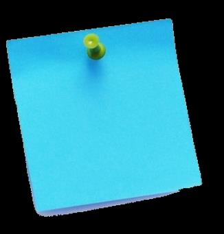

---

## Page 29

LES
ÉTAPES
DE VEILLE

---

## Page 30

1
.
        > LES ÉTAPES À ORGANISER
L
a
v
e       LA VEILLE             LES BESOINS                 LA COLLECTE                  L’ANALYSE                LA DIFFUSION

i      Revue de veille        Phase de cadrage          Outils & Méthodes            Traitement Data           Partage du pouvoir

l
    Démarche stratégique     Définition des besoins       Identification des            Vision globale         Transmission de la veille
       Type de veille            Validation des        sources d’informations &   Agrégation & segmentation       avec des contenus
     Objectifs & équipes    thématiques, des sujets,   paramétrages des outils       Analyse qualitative &    lisibles, compréhensibles
                           des mots clés & périmètre    Méthode Pull ou Push             quantitative                 & attractifs

l                                géographique                                      Évaluation des impacts

e

---

## Page 31

LES
OUTILS
DE VEILLE

---

## Page 32

2. La veille STRATÉGIQUE
  > LES DIFFÉRENTS OUTILS DE VEILLE

                                Radio                   Visiter le MONDE

  LIVRES Blogs            Conférences
                                  Pod
                                                    JournAUx

                                         CASTS Réseaux Sociaux
              vidéos
                   FilmS MAG                 newsletterssalons   MUSÉES
                  Sites
                      TV                 azines              Documentaires

Internet WEB                   inaires      SÉRIES
                                 Intelligence
                                     Artificielle

---

## Page 33

3
.
            > LES DIFFÉRENTS OUTILS DE VEILLE
L
a   Le livre des tendances
    L’anticipation annoncée …
v   Avec au menu :
e   L’érotisme post-humain

i
    Le métagame devenu nouvelle métaphysique

    Un monde selficolor où tout le monde veut être le héros

l   L’hyperpersonnalisation de masse

    Le vibecommerce

l   Le made in TikTok

e   Les cool kids qui virent à droite et le retour des cathos
                                                                Livre en accès sur réservation au sein de la salle
                                                                                                  STUDIO VIDÉO

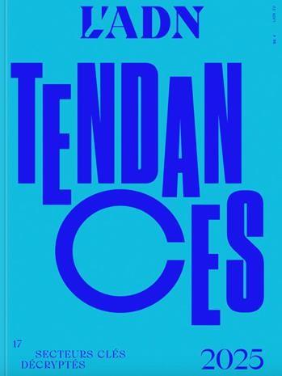

---

## Page 34

4
.
    > LES DIFFÉRENTS OUTILS DE VEILLE
L
a
v
e
i
l
l
e

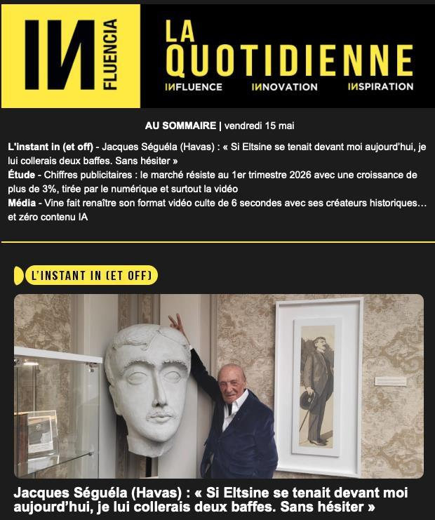

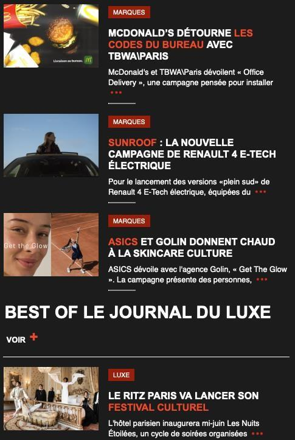

---

## Page 35

4
.
    > LES DIFFÉRENTS OUTILS DE VEILLE
L
a
v
e
i
l
l
e

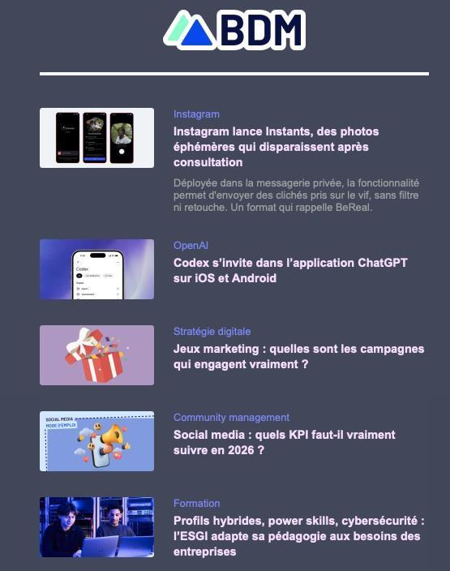

---

## Page 36

5
.
                          > LES DIFFÉRENTS OUTILS DE VEILLE
L              LES RÉSEAUX s MÉDIA SOCIAUX                                    GÉRER LA RÉPUTATION DE SA MARQUE
a
                                                                              Hootsuite :
v
Facebook       Ex Twitter    Instagram   YouTube    WeChat
                                                             1,36 milliards
                                                                              Conversations, mentions & tendances

e                                                            817 millions
                                                                              Brandwatch :
                                                                              Social listening – sentiments & émotions

i   Dribbble   Pinterest     LinkedIn    Snapchat    QQ
                                                                              Talkwalker :
                                                                              Performances marque, influenceurs & crises
l                                                            588 millions     Sprout Social :

l   Twitch      Tik Tok      WhatsApp     Reddit    Weibo
                                                                              Conversations & impacts multi plateformes

                                                                              Geolid :
e                                                                             Mesure et suivi en point de vente

---

## Page 37

6
.
    > LES DIFFÉRENTS OUTILS DE VEILLE
L
    Les plateformes de veille
a       Agrégateur de contenus – Flux RSS
                                                                                 NE WS

                                                                                           INNO

v
                                                                                         V A TI O N

         Moteur de recherche                                 NEWS
e          Agrégateur de sites internet

i          Surveillance des conversations

l
                                                             IN N O V A T IO N

           Moteur recherche & agent conversationnel
                                                      NEWS
l           Agrégateur d’articles

e           Agrégateur de sites, flux, RS …

---

## Page 38

7
.
    > DEUX OUTILS SIMPLES ET PERFORMANTS
L
    GOOGLE ALERTE                          INOREADER
a
v
e
i
l
l
e

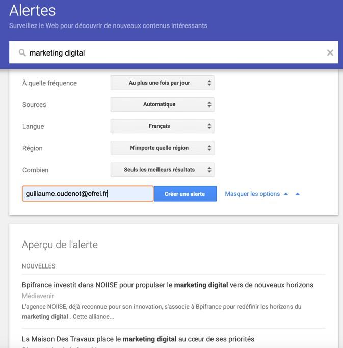

---

## Page 39

7
.
     > EXEMPLE SUR PERSONNAL BRANDING
L
a
v
e
    GOOGLE ALERTE
i
l
l
e

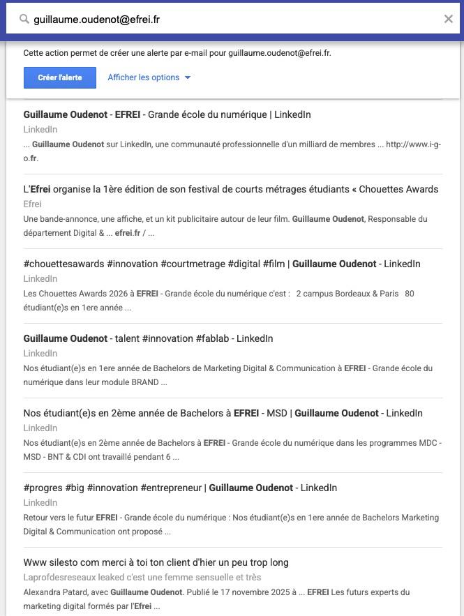

---

## Page 40

7
.
    > TROIS CAS CONCRETS
L    MARKETWAY

a
v
e
i
l
l
e

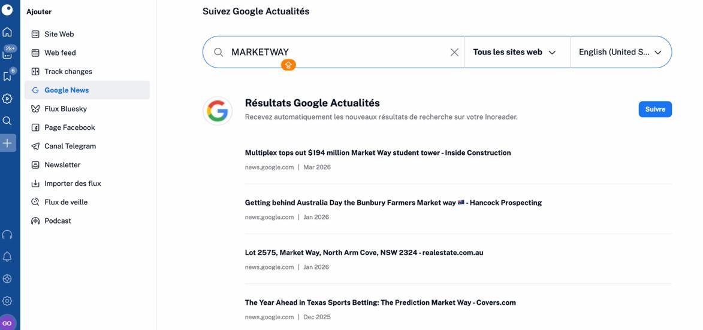

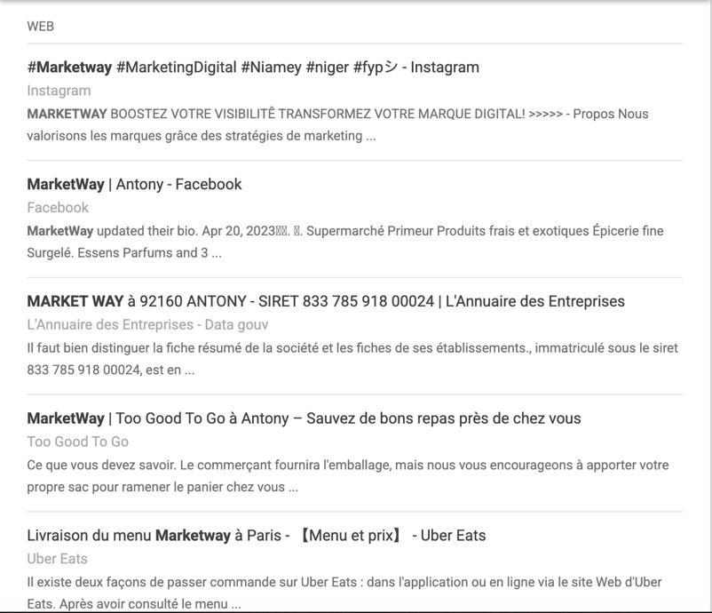

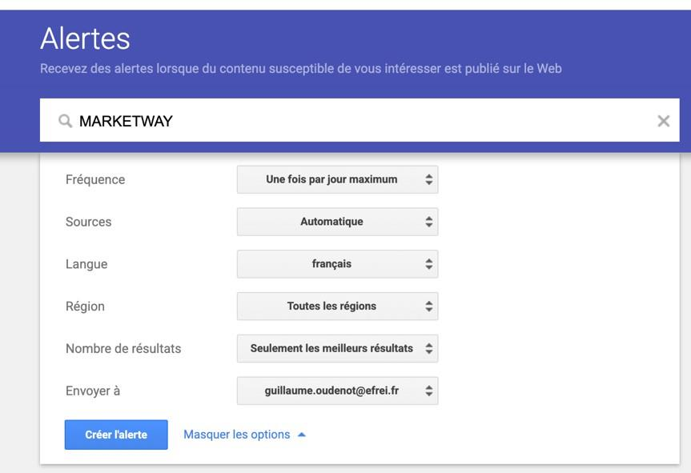

---

## Page 41

7
.
    > TROIS CAS CONCRETS
L    MARKETWAY

a
v
e
i
l
l
e

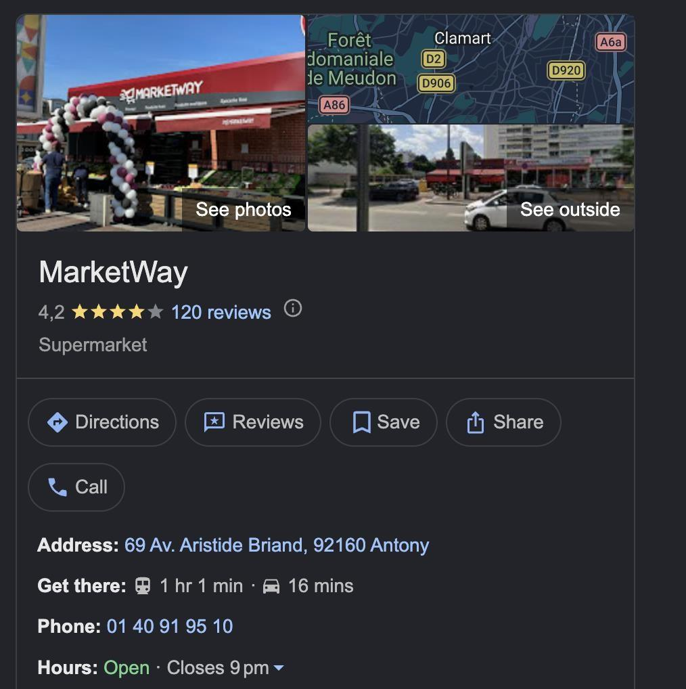

---

## Page 42

7
.
    > TROIS CAS CONCRETS
L   DERMACHECK

a
v
e
i
l
l
e

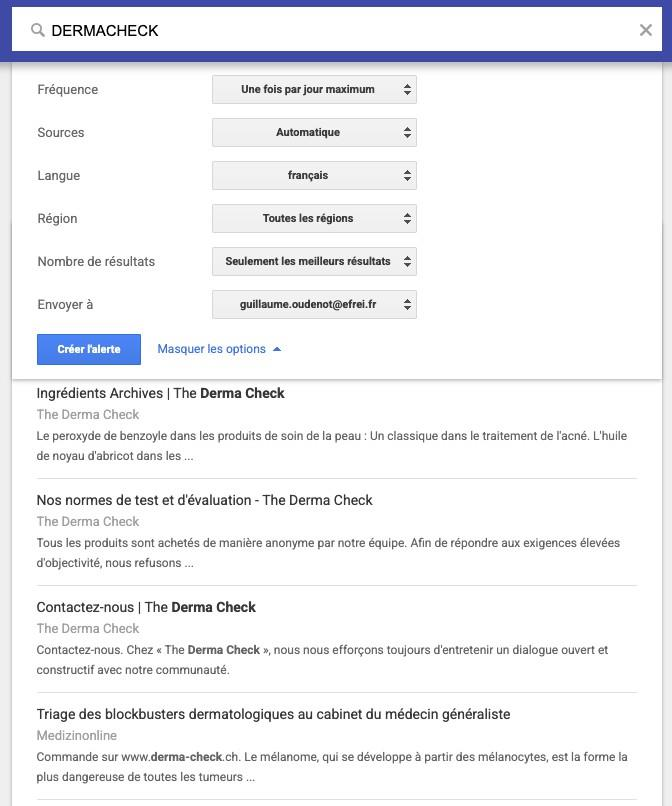

---

## Page 43

7
.
    > TROIS CAS CONCRETS
L   DERMACHECK

a
v
e
i
l
l
e

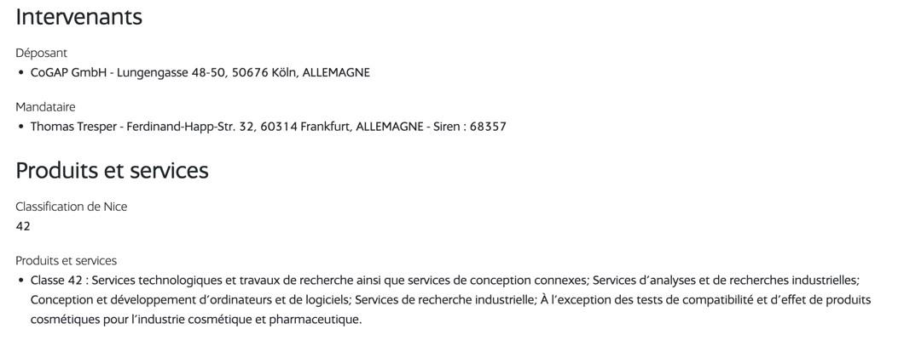

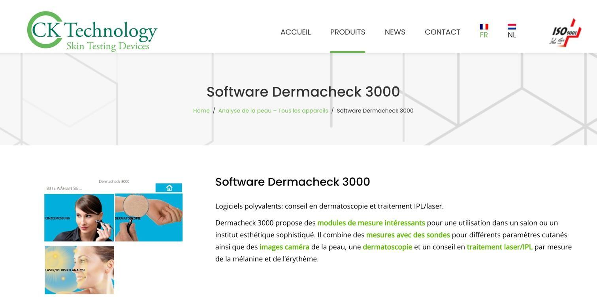

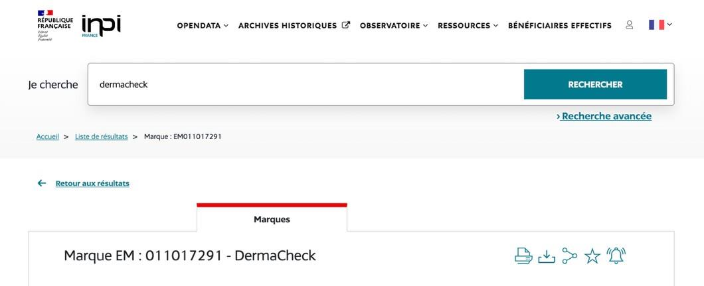

---

## Page 44

7
.
    > TROIS CAS CONCRETS
L   SENTIA

a
v
e
i
l
l
e

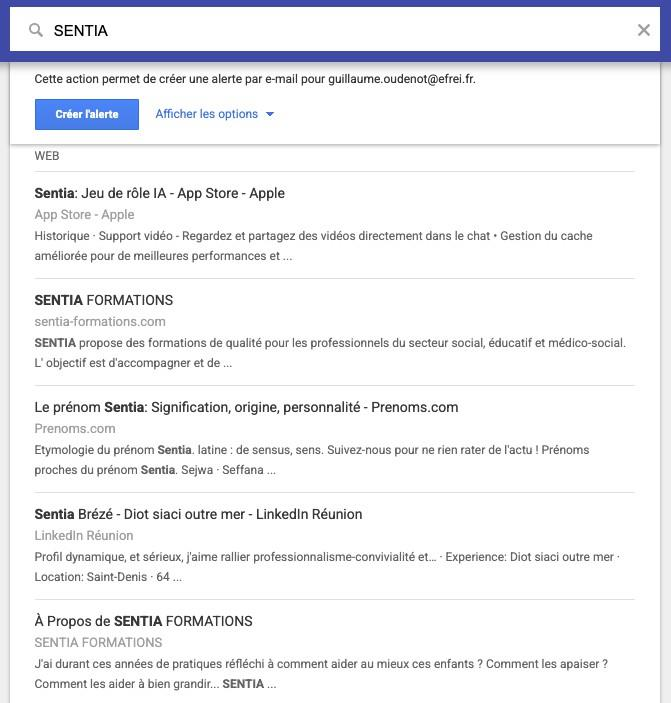

---

## Page 45

7
.
    > TROIS CAS CONCRETS
L   SENTIA

a
v
e
i
l
l
e

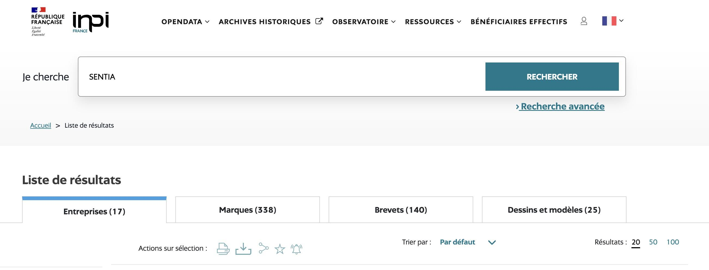

---

## Page 46

7
.
    > LANCEMENT DE LA GAME BOY - NINTENDO
L
a
v
e
i
l
l
e

---

## Page 47

               Merci !

« … Regarder en arrière est le seul
   moyen de créer le futur … »
                            Vivienne WESTWOOD
                    Punk, Newwave& Designerdemode(1941-2002)

---

## Page 48

Merci pour votre attention… et bons projets !

