# Présentation Kick Off — Innovation Projects ING2

_Source : `efrei/_raw/kickoff.pdf`_

_33 pages._

---

## Page 1

Un laboratoire de faisabilité
         PPE-ING 2

     2025-2026

---

## Page 2

Un laboratoire de faisabilité
         PPE-ING 2

     2025-2026

---

## Page 3

               Sommaire

1.Objectif du dispositif
2.Parcours Étudiant
3.Les Modalités d’Évaluation
4.Les outils de suivi
5. Le call to actions

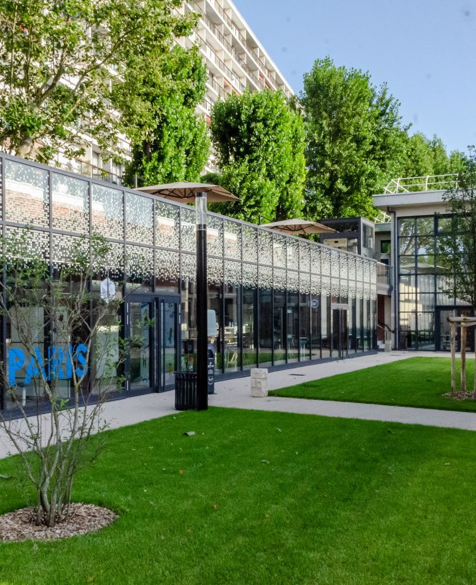

---

## Page 4

                         Les quatre objectifs pédagogiques
                            de l’INNOVATION PROJECTS
                                                                         Link
                                    Objectif 2:                                                Objectif 4

                                    Application des compétences                                Créativité et innovation
                                    et connaissances acquises
                                    durant le cursus

Objectif 1 :                                                      Objectif 3

Mise en situation professionnelle                                   « Learning by doing et
en mode projet.                                                   learning by experiencing »
                                                                  Nouvelles compétences

Placer les élèves devant un problème complexe pour évaluer la solution proposée mais surtout son cheminement

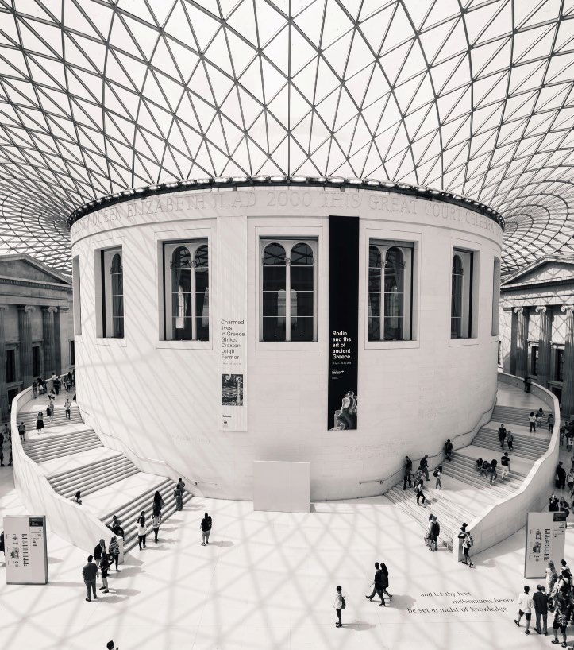

---

## Page 5

            Objectif Pédagogique du dispositif
            Projets Final D’Etude – (PPE)- ING2

                   Projet Pluridisciplinaire en Equipe (PPE-ING2):

Réalisation d’un projet en équipe de l’idée au prototype, en réponse à un besoin réel,
        mobilisant tous les acquis d’apprentissages de leur niveau d’étude et
                      favorisant une démarche professionnelle

---

## Page 6

     Structuration des Innovations Projects

                       Projets Transverses   Etudiants toutes filières à l’exception de la filière
                            classiques       cyber

 Projets transverses
        – I2
Innovation Projects

                       Projets Transverses
                                             Etudiants de la filière Sécurité et Réseaux
                            INFRASEC
                                             (majeures CC, CIL et CSIG) Amphi 001- Midi

---

## Page 7

   Projets Transverses:
   un dispositif de la Prépa1 à ING 3
           Travail
                               Green IT/IT            Innovation &                             Monde de
       collaboratif et                                                     Entreprenariat
                                for Green              Recherche                              l’entreprise
           créatif

       Du problème à sa       De l’idée au projet    De l’idée au projet    Du projet au    Du prototype à la
     résolution technique   (Approche utilisateur)   (Approche client)       prototype         validation
          en équipe

         Prépa 1                Prépa 2                  Ing 1                 Ing 2            Ing 3

  Une expérience pédagogique pluridisciplinaire et collaborative de la Prepa 1 à Ing 3
        qui développe méthode, organisation, créativité et professionnalisme

Agir en créateur de valeur responsables et curieux des usages des technologies

---

## Page 8

                              Les projets transverses dans
                                l’écosystème de l’Efrei
                                              Efrei Research Lab & Service Entreprise

                                                                                                                              Incubateur
Probleme                                                               Innovation- Lab

                                                    Objet/                                                                                                   Produit/
                                                                                                     Prototype                                            Service/Article
                                                 Proto-service

Ressource             Formulation                                   Faisabilité                           Développement                          Lancement

                                                                              Projets Transverses
            A chaque niveau de la P2 à I3, des projets proposés de différentes maturités technologiques peuvent intégrer le processus de transformation

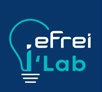

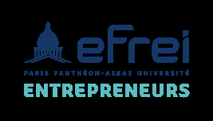

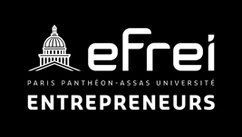

---

## Page 9

             Sommaire

1.Objectif du dispositif
2.Parcours Étudiant
3.Les Modalités d’Évaluation
4.Les outils de suivi
5. Le call to actions

---

## Page 10

                              Milestones 25-26
Recueillir et définir les besoins /CDC                                        Concevoir des solutions/Démo fonctionnelle

                                  Validation du projet /
                                   cahier des charges

               10 Avril                               Mai- juin                                      16-juillet

                                      Avril                              3-juillet
                                                                                   Poster-Demo
                                                                                  Soutenances .

                Kick Off(s)                                  Validation                           Innov’Poster Prize
                                                                                                      Recompenses les 6
               candidater & Prendre                        Phase de Réalisation                      meilleurs projets et des
              RDV Mentor / déposant
                                                                                                             posters

---

## Page 11

                        Des éléments de cadrage
                        séquencés pour suivre le projet
  Ing2-                              Ing2-                         Ing2-                        Ing2-
Mars - Avril                        10 avril                    10 avril- Juin               Juin- Juillet

                               Création des équipes         Affectation Mentor & Experts
  Appels à Projets                                                                         Soutenances et Evènements:
                                 et candidatures:           et lancement des projets:
       Ing2:

                         2 Guide de Démarrage de Projets    4 Charte du Mentorat&
Guide Appel à projets                                                                      5 Guide Rendus et Soutenances
                         pour les étudiants                 Charte Partenariale
 pour les déposants                                                                        6 Guide Evènements
                         3 Guide de Remédiation Etudiants
                         sans équipe

---

## Page 12

Planning Projets Transverses

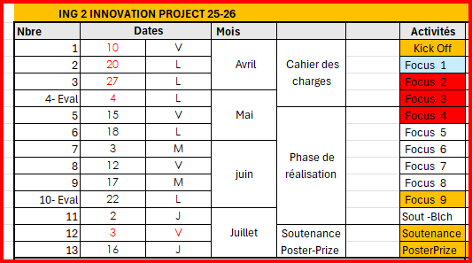

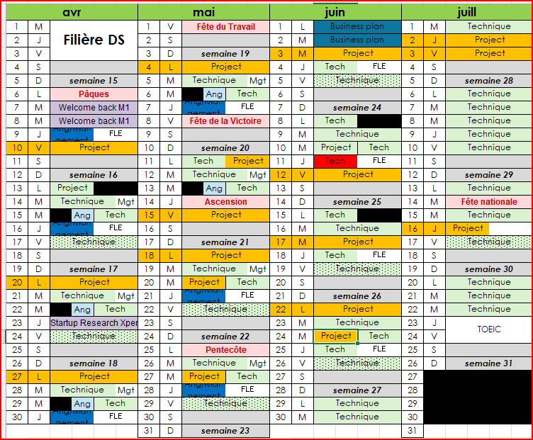

---

## Page 13

                                                          Innovation Project -

                                                                                    Hotline
                                   Activités:    Focus thématique de 9 h15 à 10 h
Dates Jour Mois   Séquencement
                                   en distanciel
                                                                                  Rescure sur Activités de l’équipe
                                                                                  Teams
                                                                                                                                              Format
6 au
10
     4    Avril
                  Pré
                  enregistrement
                                   Candidature des équipes
                                                                                               Candidatez en équipe via le lien
                                                                                               Calendly
                                                                                                                                  8 focus en distanciel de 50 min
10   V    Avril
                  Cahier des
                                   Kick-Off -
                                                                                               Disponible pour RDV Déposant &        entre 9H10 approx 10H00
                  charges                                                                      Mentor
                  Cahier des       Focus 1 : Réaliser un Etat de l’art/ Veille                 Disponible pour RDV Déposant &
20   L    Avril
                  charges          scientifique et technique                                   Mentor
                  Cahier des       Focus 2 : Pourquoi un ingénieur doit penser                 Disponible pour RDV Déposant &
27   L    Avril
                  charges          “marché” ?                                                  Mentor
                  Cahier des                                                                   Disponible pour RDV Déposant &
4    L    Mai                      Focus 3: Pourquoi parler de vision produit ?
                  charges                                                                      Mentor

                  Phase de         Focus 4 : Pourquoi l’innovation sans veille est             Disponible pour RDV Déposant &
15   V    Mai
                  réalisation      une reproduction inconsciente ?                             Mentor

                  Phase de                                                                     Disponible pour RDV Déposant &
18   L    Mai                      Focus 5 : Eco - conception/ Green It
                  réalisation                                                                  Mentor
                  Phase de         Focus 6 : Création d’un Poster dans les                     Disponible pour RDV Déposant &
3    M    Juin
                  réalisation      règles de l’art                                             Mentor
                  Phase de                                                                     Disponible pour RDV Déposant &
12   V    Juin                     Focus 7 : Preuve de concept / TRL
                  réalisation                                                                  Mento
                  Phase de                                                                     Disponible pour RDV Déposant &
17   M    Juin                     Focus 8 : Bien préparer sa Démo
                  réalisation                                                                  Mento
                  Phase de         Focus 9 : Quand est-ce que le projet sera                   Disponible pour RDV Déposant &
22   L    Juin
                  réalisation      terminé ?                                                   Mento
                  Phase de                                                                     Disponible pour RDV Déposant &
2    J    Juillet                  Soutenance -Blanche- Factory
                  réalisation                                                                  Mento
                  Soutenance-
3    V    Juillet Poster-Prize     Soutenances- Bat New Republic

---

## Page 14

                          Les modalités de suivi des projets - 1

       3 rdvs /Projet ( 30 min/RDV) Expert                                             Mentor 15 h/projet
                                                                                      capitalisation,
                                  Expertise technique,                                coordination,
                                      ressources                                        ressources

                                                         1.5 h              12 h – (15- 20 min /projet/Séance)-
           Commanditaire
    2 h/     Cahier des charges                                                       L'équipe projet : une équipe est constituée de 5 à 6 membres.
projets/mois Expertise métier
                                                                                      Les étudiants nomment parmi eux un «Référent» Il n’a pas de
                                                                                      responsabilité hiérarchique sur le groupe, mais se positionne
                                                                                      en transversal dans l’animation du projet et la communication
                                                                                      aux référents

                                                                 Equipe Projet

---

## Page 15

                  Les modalités de suivi des projets - 2
                          Format Atelier

Focus - 40 min          Explication sur les attendus de la session ( distanciel)
  9h- 10H00

 Projets 7 h           Vous êtes autonome sur la manière d’organiser vos journées Innovation
Call to actions        Projects-
                       RDV, Mentor, Expertise, Partenaire

           Organisation de travail collaboratif- Participation active et créativité.

---

## Page 16

                        Les modalités de suivi des projets - 2
                  capitalisation,
                  coordination,
                    ressources
Mentor
                       15 h

                                                        Experts

                                         Sketchnote
                                           0.5 h
                                                                  • Expertise &Ressources
Durée du projet                             CDC                   • Les équipes ont 3 jetons obligatoires
                                           0.5 h

                                    Conception/Réalisation
                                            0.5 h

                  capitalisation,
                  coordination,
                    ressources
 Mentor
                        15 h

---

## Page 17

               Sommaire

1.Objectif du dispositif
2.Parcours Étudiant
3.Les Modalités d’Évaluation
4.Les outils de suivi
5. Le call to actions

---

## Page 18

                        Ventilation des Evaluations

                                                                Contrôle Continu
    Données        RAP (Expert)   SOUT (Jury)
                                                    Par le Mentor                     Par les pairs

   % Niveau 1          30             40                                30

  Granulométrie      Equipe         Equipe      Equipe                       Individuelle

   % Niveau 2          30             40          30                             70

    Typologie        Note R         Note S      Note ME       Note MI        Note PLP1           Note PLP2

   % Niveau 3                                                   60                          40
                       30             40          30
   % Niveau 4                                                   60               20                 20

Note finale=0,3*R + 0,4*S + 0,3*(0,3*ME + 0,7*(0,6*MI + 0,4*(0,2*PLP1 + 0,2*PLP2)))

---

## Page 19

Evaluations par les compétences

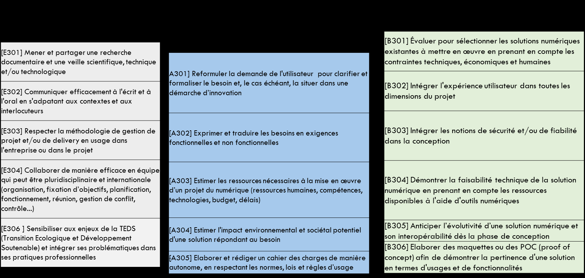

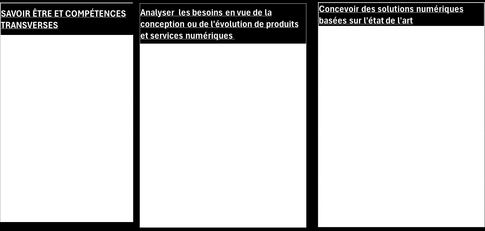

---

## Page 20

                            Les attendus & Actions
    •Gestion des risques : Intégration structurée de la notion de risques projet

    → Appui sur le Guide – Gestion des Risques de Projet

    •Vision globale du projet Formalisation de la vision d’ensemble (sketchnote)

    → 1er rendez-vous Expert : cadrage stratégique et cohérence globale

    •Éco-conception – mise en œuvre concrète ntégration d’éléments opérationnels
    d’éco-conception

    → 2e rendez-vous Expert – Bilan intermédiaire

    • Notion de TRL

    → 3 ème rendez vous- appui pour votre réalisation Démo

Planning de réservation des créneaux de soutenance – fin juin

• Modèles de rapport Modèles officiels disponibles sur Notion et Moodle ( 20 /04)
  → Structure attendue, consignes et critères d’évaluation intégrés- Latex Editor Et Overleaft
Modèles de poster- 20/04 Gabarits fournis pour assurer l’homogénéité visuelle et la lisibilité des projets-

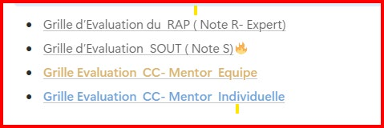

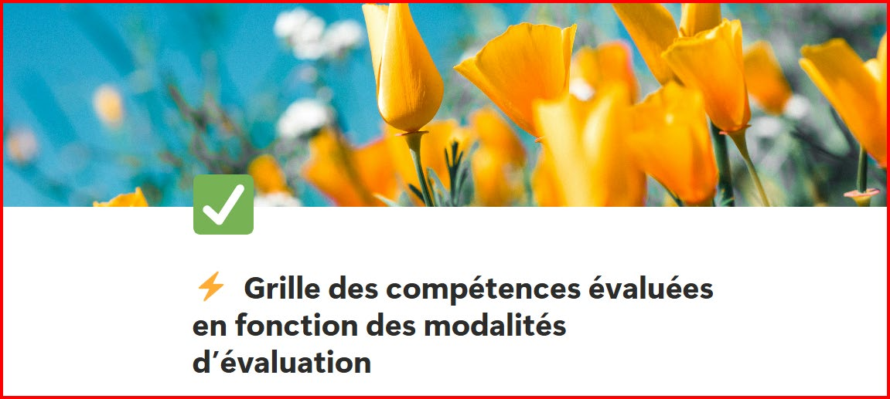

---

## Page 21

             Sommaire

1.Objectif du dispositif
2.Parcours Étudiant
3.Les Modalités d’Évaluation
4.Les outils de suivi
5. Le call to actions

---

## Page 22

Les outils de votre projet

        Outil Ecole pour le pilotage des projets ( Suivi, dépôt docs
        & notes )

           Outil pour de diffusion d’informations opérationnelles

        Outil pour de diffusion de suivi pédagogique du
        projet

---

## Page 23

            Tableau de bord pour un suivi opérationnel des projets
                                                          + 10
                                                        Experts

                                                                                      Mentor

                          Modalité de la

                                                       Commentaire
                                                                                             Evaluation
                                           ODJ slide
                                                                     Evaluation   Notation
                   Date
                                           avant RDV
                           rencontre

EXPERTISE
                            Accès à l’ensemble de l’équipe

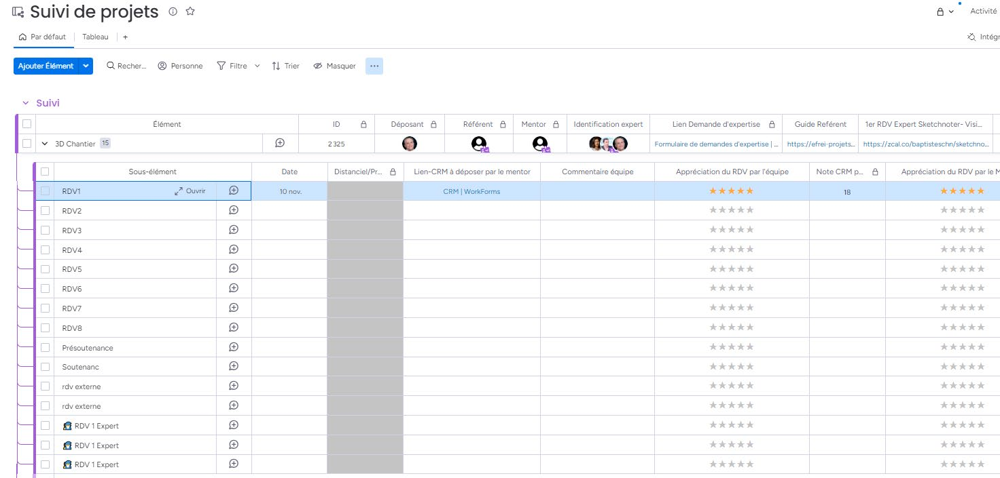

---

## Page 24

Onboarding en 3 étapes

                         1

                         2

                         3

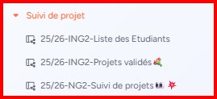

---

## Page 25

Onboarding : Etape n°1
       1
                         1

                 1

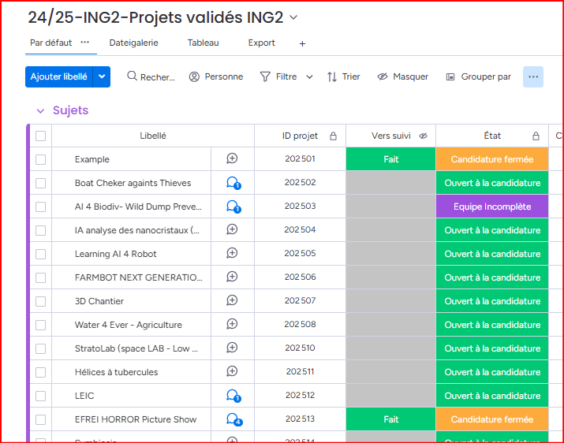

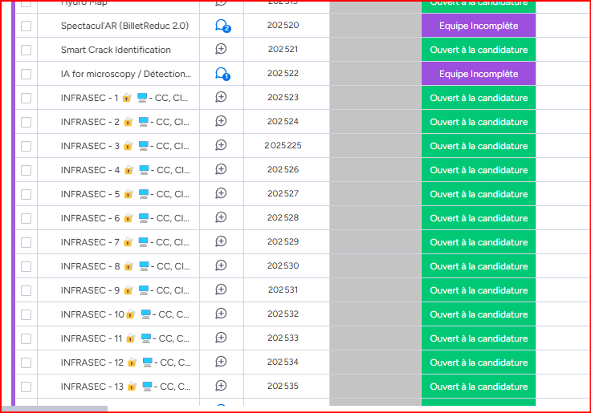

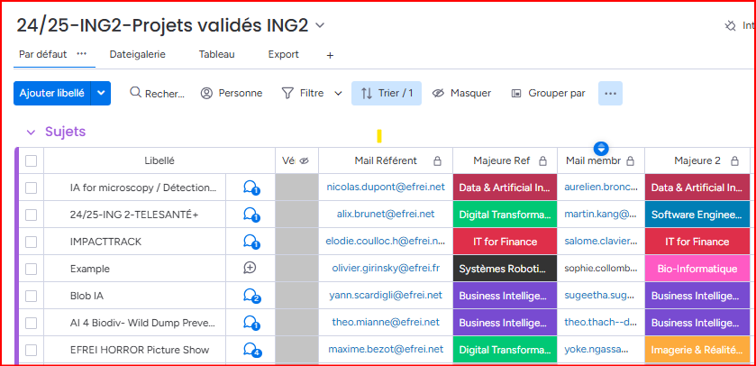

---

## Page 26

Onboarding : Etape n°2
      2                  2

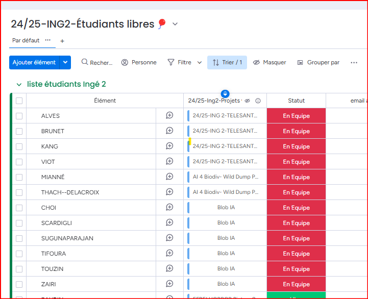

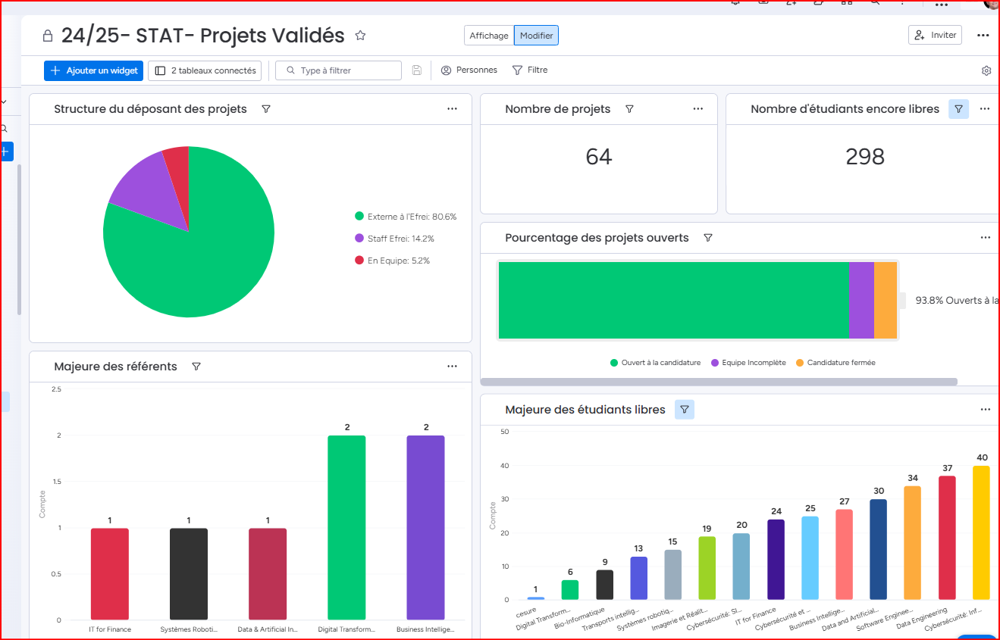

---

## Page 27

Onboarding : Etape n°3
                3

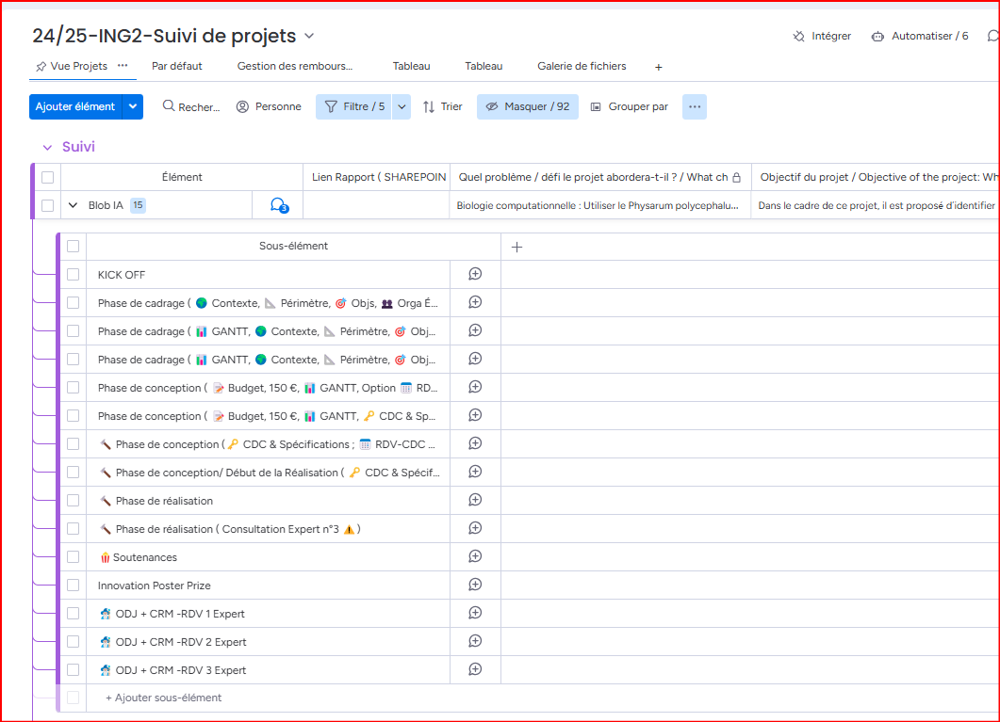

---

## Page 28

                                 EXPERTISE     MONTORAT

                                                 Date
                                         Modalité de la
                                          rencontre

                                              ODJ slide
                                              avant RDV

                                             Commentaire           + 10
                                                                 Experts
Accès à l’ensemble de l’équipe

                                              Evaluation

                                               Notation

                                                            Mentor
                                               Evaluation

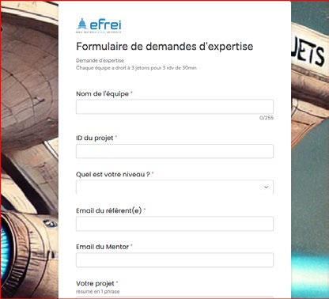

---

## Page 29

Tableau de bord pour un suivi opérationnel des projets

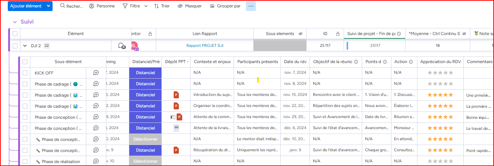

---

## Page 30

                                Rendus : Quoi et Quand

•Compte Rendu Minute ( CRM) - 9 avril au 2 juillet– Moyenne sur 8 RDV Mentor / Expert

•Soutenance ( Poster et DEMO) - 3 juillet deadline   – Infos sur Notion & Moodle

•Rapport final - 6 juillet deadline   Monday – Infos sur Notion & Moodle
                                                                                   •   Projet de Service   ,
                                                                                   •   Projets Produit
                                                                                   •   Technique

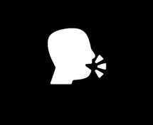

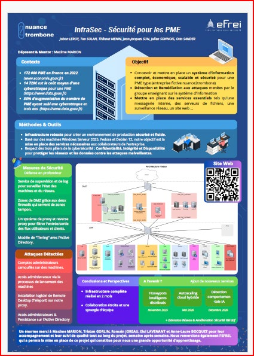

---

## Page 31

Innovation Lab EFREI Paris-

                           I-lab un partenaire central
                              des projets transverses

                            Conception & réalisation
                   marion.cragnolini@efrei.fr

                           d’objets ou d’équipements
                                Point de Contact : marion.cragnolini@efrei.fr

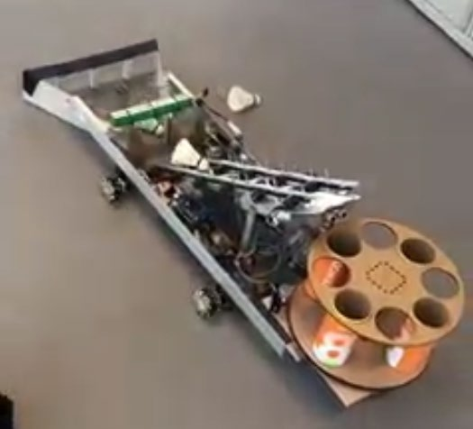

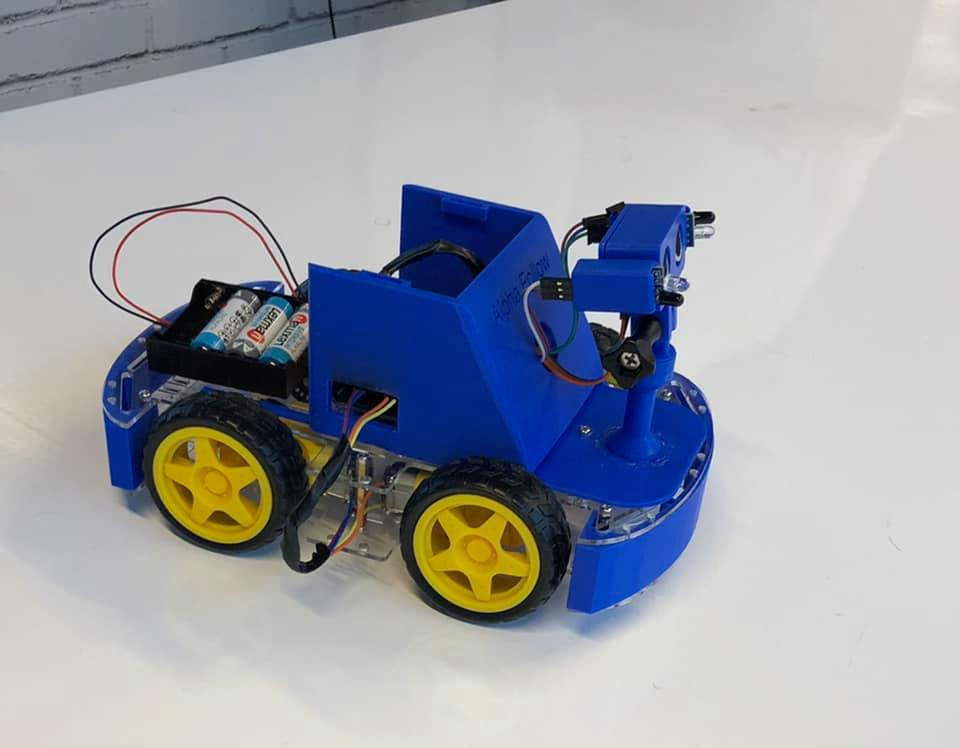

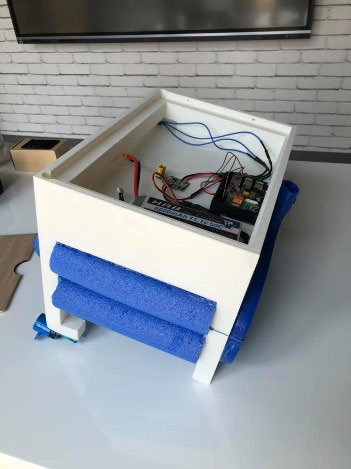

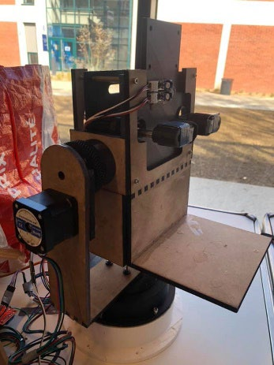

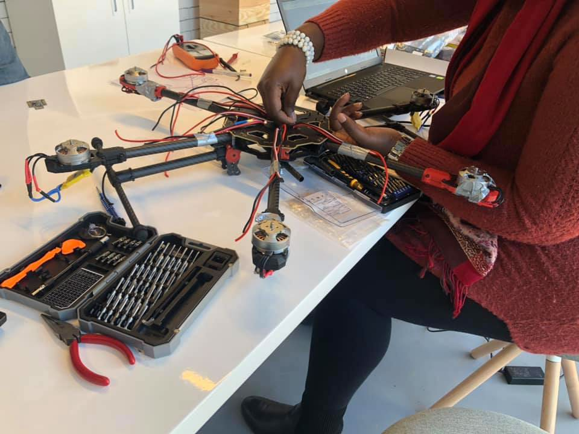

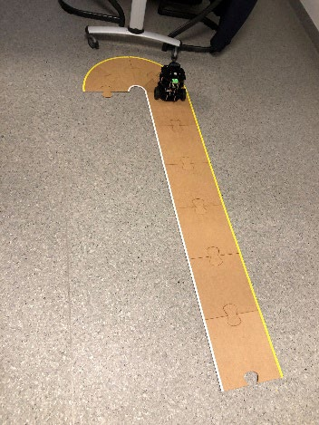

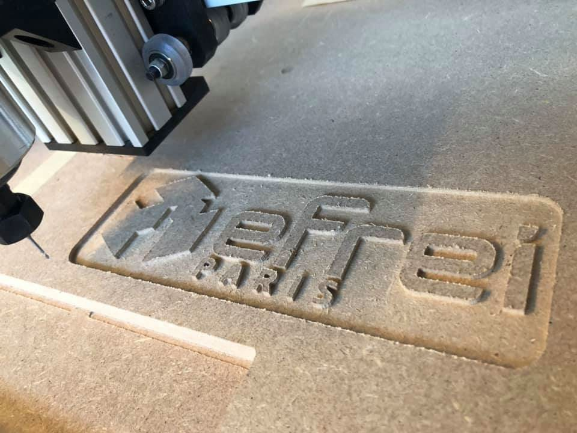

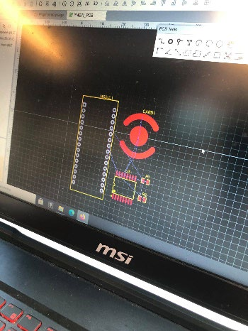

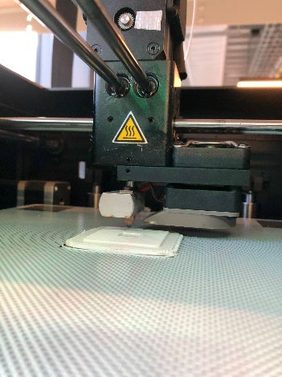

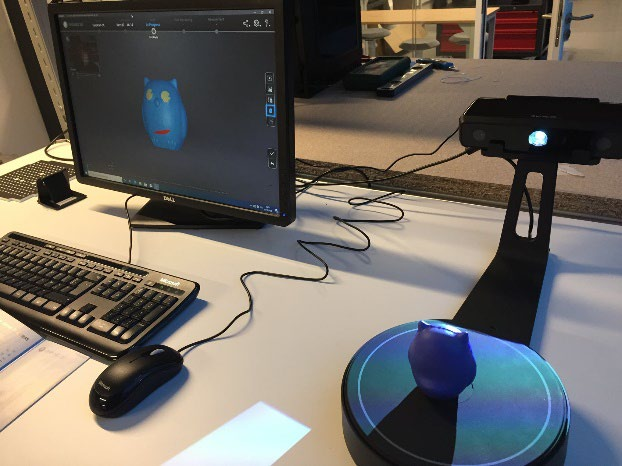

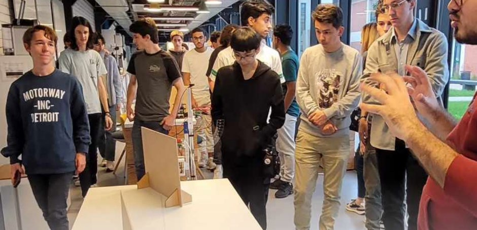

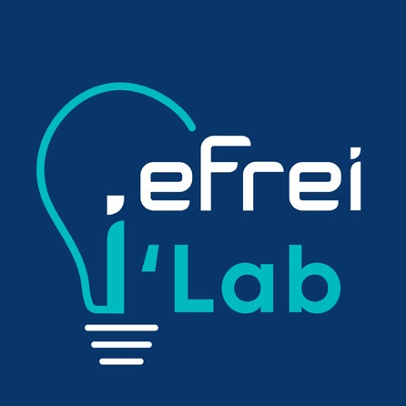

---

## Page 32

                           Call to actions: 9 Avril
                       Création d’équipe & candidatures
Rappels des principales étapes :

•     Aujourd’hui le 9 Avril : choix/candidature des équipes sur la liste des projets
validés.

Pour info, une permanence sera organisée en +      HOTLINE TEAMS pour les
équipes/étudiants qui ont des questions et/ou n'ont pas de projet ou d'équipe.

•     À partir d'aujourd'hui : les équipes ayant déjà un projet validé peuvent prendre
contact avec leur Mentor & Déposant ensemble           (Tableau Monday : Suivi de
projet). (                                                                               1
•      Aujourd’hui : Les équipes complètes en INFRASEC, vous avez RDV avec
l’EQUIPE de MAXIME MARION- AMPHI A 001 à 12 H00                                          2
  Kind Reminder : toutes les informations sont sur Notion - Guide de Démarrage. Et       3
Moodle

Une rubrique Moodle figera les informations par semaine et sera publiée d'ici demain.

---

## Page 33

                            Tech        Day
                GET INSPIRED, MAKE IT HAPPEN!   Mercredi 12 Juin 2024

    Une question ? Contactez nous – RDV –
sur la HOTLINE RESCUE -    TEAMS

Olivier Girinsky – RESP. PÔLE EXPERTISES PROJETS TRANSVERSES olivier.girinsky@efrei.fr

