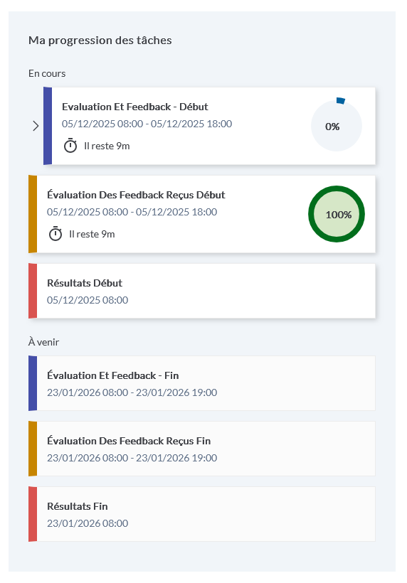
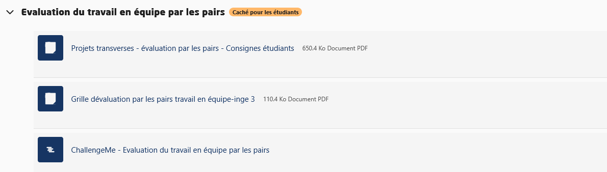
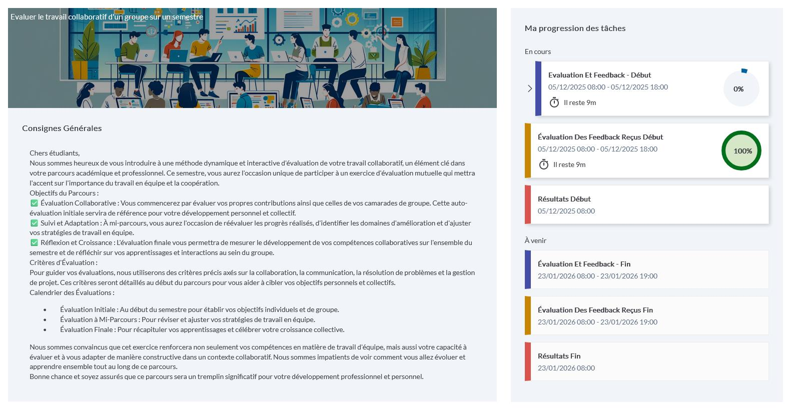
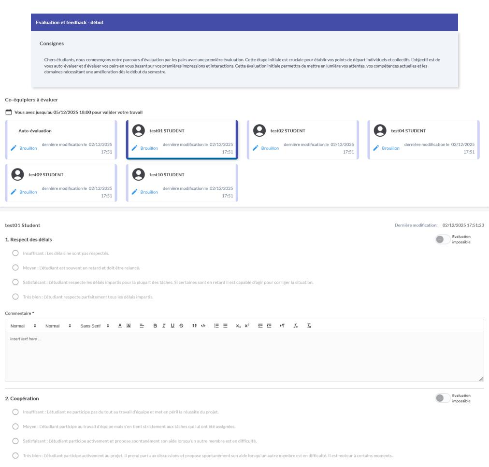

# Évaluation par les pairs — Consignes étudiants

_Source : `efrei/_raw/peer-eval-consignes.pdf`_

_5 pages._

---

## Page 1

    L’évaluation par les pairs – Pour quoi ?

➢ Un projet se mène en groupe
➢ Le projet a besoin des compétences de chacun des membres pour réussir
➢ Il est nécessaire de faire des ajustements pour chacun s’implique
  pleinement dans le projet
➢ Un ingénieur doit pouvoir exprimer ses attentes envers ses équipes et
  recevoir celles autres pour permettre à l’équipe de fonctionner le mieux
  possible.

            Savoir donner et recevoir des feedbacks sur les membres de
            son équipe pour améliorer son fonctionnement

---

## Page 2

                            L’évaluation par les pairs - principes

                                              ➢ Chaque membre évalue les autres membres du groupe
                                              ➢ En se basant sur une grille critériée
Evaluation des membres d’un groupe            ➢ De manière anonyme entre vous
            Savoir-être
                                              ➢ En rédigeant des feedbacks
                                              ➢ En donnant votre retour sur les feedbacks reçus
         Monde professionnel

              Soft skills
                                                  De manière constructive pour permettre à chacun de
                                                  progresser et d’améliorer le fonctionnement de l’équipe

---

## Page 3

      L’évaluation par les pairs – Rédiger un feedback
                                       Faite des retours ciblés, précis et
                                     constructifs, permettant à l'étudiant   Utilisez des exemples et donnez des
Ne jugez pas la personne que vous
                                    que vous évaluez de comprendre ce qui    suggestions d'amélioration si vous le
    évaluez, jugez son travail.
                                      est bon ou non dans sa production.                    pouvez.

ce paragraphe       tu écris de       Les définitions                                Tu as utilisé cette formule
                                                           C'est du bon
manque de           manière trop      aident à la                                    mathématique, il me semble
                                                           travail.
détails             vague             compréhension                                  que c'est plutôt celle-là qu'il
                                                                                     faut utiliser.

                  Pour être efficace, un feedback doit comporter les éléments suivants :
                                        ➢ Des faits objectifs
                                        ➢ Les points forts
                                        ➢ Les axes d’amélioration
                                        ➢ Des pistes d’amélioration

---

## Page 4

                                  L’évaluation par les pairs – Concrètement
                                          En 2 temps de 3 phases :

                                                                     1   Phase 1 : évaluation des membres du groupe

         1er temps : point d’étape
                     Mi-mai 2026                                         Phase 2 : Réception des évaluations et appréciation de
                                                                     2   l’aspect constructif
                                                                         Phase 3 : possibilité de lire les commentaires
                 Ajustements et                                      3   jusqu’à la fin du projet
                    progression

2e temps : bilan de la progression
                      Fin juin 2026

---

## Page 5

                L’évaluation par les pairs – Concrètement
Depuis Moodle

                                                                 3 Sélection de l’étudiant évalué
                   1   Accès à l’activité

                                            2 Sélection
                                              de la phase

                                                            4
                                                Evaluation de
                                                    l’étudiant

